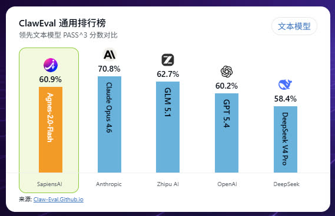

# 白嫖全球Top10 AI实验室的API？Agnes AI免费使用全攻略

> 2026年了，大模型API还只能花钱买？今天介绍一个"AI平权"玩家——Agnes AI，不仅模型质量挤进全球榜单前列，还直接开放了**免费API**。本文带你注册、调通、跑通第一个图片生成，最后分享我自己写的一个AI绘图技能。

---

## 一、Agnes AI 是谁？

打开 [agnes-ai.com](https://agnes-ai.com)，首页赫然写着：

> **AI Parity for the 99% — Inclusion and Accessibility for All**

翻译过来就是：让99%的人都能用上AI，普惠、开放。

它的母公司 **SapiensAI** 是一个新加坡公司，自称全球Top 10 AI实验室，旗下产品线非常完整：

| 类别 | 模型 | 说明 |
|------|------|------|
| 文本 | Agnes 1.5 Flash | 轻量级文本模型 |
| 文本 | Agnes 2.0 Flash ⭐ | 最新旗舰文本模型 |
| 图像 | Agnes Image 2.0 Flash | 稳定版图像生成 |
| 图像 | Agnes Image 2.1 Flash ⭐ | 最新旗舰图像生成 |
| 视频 | Agnes Video V2.0 | 文生视频 / 图生视频 |

除了模型，还有三款AI原生应用：**Agnes**（对话助手）、**Pavo**（创作工具）、**Echo**（语音/音频）。

### 榜单成绩



官网放出了三组对比数据，来源分别是 ClawEval 和 Artificial Analysis：

- **文本模型**（ClawEval PASS³）：Agnes-2.0-Flash 得分 **60.9%**，与 GPT 5.4（60.2%）和 DeepSeek V4 Pro（58.4%）处于同一梯队
- **图像模型**（AA Image Elo）：Agnes-Image-2.0 Elo **1178**，紧随 GPT Image 2（1250）和 Nano Banana Pro（1240）
- **视频模型**（AA Video Elo）：Agnes-Video-V2.0 Elo **934**，与 Kling 3.0、Seedance 1.5 Pro 同台竞技

不管榜单是否有水分，至少说明 Agnes 不是"玩具级"产品。关键是——**它免费**。

---

## 二、免费API：注册即用

### 获取 API Key

1. 访问 [agnes-ai.com](https://agnes-ai.com)
2. 点击右上角 **Login** 注册/登录
3. 进入 **API Platform** 页面
4. 生成你的 API Key（`sk-xxxx` 格式）

就这三步，没有信用卡验证，没有企业邮箱限制。

### API 基本信息

| 项目 | 值 |
|------|-----|
| Base URL | `https://apihub.agnes-ai.com/v1` |
| 认证方式 | `Authorization: Bearer ***
| 协议 | OpenAI 兼容格式 |
| 内容类型 | `application/json` |

**OpenAI 兼容** 是个大亮点——意味着你用 OpenAI SDK 或任何支持自定义 `base_url` 的框架，改一行配置就能无缝切换。

---

## 三、实测：到底好不好用？

我用自己的 API Key 做了一组真实测试，以下是结果。

### 测试1：文本对话（Agnes 2.0 Flash）

向 `chat/completions` 端点发一句 "Introduce yourself in one sentence."，**1.3秒**就收到了回复：

> I am Agnes-2.0-Flash, a language model developed by Sapiens AI.

回答简洁准确，共消耗 238 tokens（prompt 216 + completion 22）。这个响应速度在免费API里算很快了。

### 测试2：图像生成（Agnes Image 2.1 Flash）

向 `images/generations` 端点提交一个描述："a cute robot reading a book in a cozy library"，约 **19秒**后返回一张 1024×1024 的图片（约1.5MB）。


> 上面这张图就是用 Agnes Image 2.1 Flash 生成的，prompt 是"a futuristic AI gateway portal connecting multiple glowing neural network nodes"。色彩饱满、构图干净，19秒出图，对免费API来说相当能打。

### 测试3：查看可用模型

调用 `models` 端点，返回5个可用模型：`agnes-1.5-flash`、`agnes-2.0-flash`（文本）、`agnes-image-2.0-flash`、`agnes-image-2.1-flash`（图像）、`agnes-video-v2.0`（视频）。

### 测试感受总结

| 维度 | 评价 |
|------|------|
| 注册门槛 | ⭐⭐⭐⭐⭐ 零门槛，注册即用 |
| API 兼容性 | ⭐⭐⭐⭐⭐ OpenAI 格式，无缝替换 |
| 文本模型速度 | ⭐⭐⭐⭐ 1.3s 响应，很快 |
| 图像生成速度 | ⭐⭐⭐ 19s 出图，中等偏慢 |
| 图像质量 | ⭐⭐⭐⭐ 色彩好、构图干净，文字渲染一般 |
| 文档完整度 | ⭐⭐⭐ 有 Developer Docs，但示例偏少 |
| 免费额度 | ⭐⭐⭐⭐ 目前免费使用，具体限额未公开 |

---

## 四、Python 快速上手

因为 Agnes 兼容 OpenAI 格式，所以最省事的方式就是直接用 OpenAI SDK：

```python
from openai import OpenAI

client = OpenAI(
    api_key="sk-你的key",
    base_url="https://apihub.agnes-ai.com/v1"
)

# 文本对话
response = client.chat.completions.create(
    model="agnes-2.0-flash",
    messages=[{"role": "user", "content": "什么是AI Agent？"}]
)
print(response.choices[0].message.content)

# 图像生成
image = client.images.generate(
    model="agnes-image-2.1-flash",
    prompt="a cyberpunk cat wearing sunglasses",
    size="1024x1024"
)
print(image.data[0].url)  # 下载这个URL即为图片
```

只需要把 `base_url` 指向 Agnes，其他代码跟用 OpenAI 完全一样。如果你不想装 SDK，用 `curl` 或 `urllib` 也完全没问题——标准的 RESTful JSON 接口。

---

## 五、⚠️ 踩坑记录

实际使用中踩过几个坑，分享给大家避雷：

**1. 图片尺寸只能是 1024×1024**

`size` 参数传其他值（如 `1280x720`）会直接返回 HTTP 500。如果需要非正方形图片，先生成 1024×1024，再用 ffmpeg 裁剪/缩放。

**2. 图片通过 URL 返回，不是 base64**

响应里的 `b64_json` 字段始终是 `null`，要读取 `url` 字段下载图片。别被字段名骗了去 decode base64，会报 TypeError。

**3. Prompt 用英文效果更好**

中文 prompt 也能用，但出图质量和 prompt 遵循度明显不如英文。建议用英文描述。

---

## 六、分享：agnes-image 自研技能

为了在日常工作中更方便地使用 Agnes AI 生成图片，我基于 Hermes Agent 开发了一个叫 **agnes-image** 的技能（Skill）。它封装了 API 调用、风格预设、自动缩放等常用功能，一行命令就能出图。

### 功能特点

- **10种风格预设**：写实、数字艺术、水彩、动漫、像素、技术图、扁平设计、3D渲染、油画、素描
- **自定义尺寸**：自动处理 1024×1024 → 目标尺寸的缩放（依赖 ffmpeg）
- **多种输出格式**：PNG / JPG / WebP
- **零外部依赖**：纯 Python 标准库，不需要 pip install 任何东西
- **双模式**：CLI 命令行 + Python 函数调用

### 提示词用法（Claude/Codex/OpenClaw/Hermes等均支持）

```
用agnes-image技能生成一张图片：wild angle, a beautiful lady walking along a beach, sunrise background, photorealistic style
```

### 风格预设速查表

| 风格 | 效果描述 | 适用场景 |
|------|---------|---------|
| `photorealistic` | 照片级写实，8K细节 | 产品图、人像 |
| `digital-art` | 数字插画，色彩鲜艳 | 博客配图、海报 |
| `watercolor` | 水彩画，柔和边缘 | 文艺类配图 |
| `anime` | 日系动漫风格 | 二次元内容 |
| `pixel-art` | 16-bit 像素风 | 游戏相关、复古主题 |
| `technical` | 技术图表，白底专业 | 架构图、流程图 |
| `flat-design` | 扁平设计，无渐变 | UI素材、图标 |
| `3d-render` | 3D渲染，体积光 | 产品展示、场景 |
| `oil-painting` | 古典油画，笔触明显 | 艺术类配图 |
| `sketch` | 铅笔素描，黑白线条 | 概念设计、草稿 |

### 常用尺寸参考

| 用途 | 尺寸 | 说明 |
|------|------|------|
| 社交媒体头像 | 1024×1024 | 原生尺寸，无需缩放 |
| 博客封面（OG） | 1200×630 | Open Graph / Twitter Card |
| 微信公众号封面 | 1024×436 | 公众号大图 |
| 高清横幅 | 1920×1080 | 16:9 宽屏 |
| 文章内嵌图 | 800×600 | 4:3 标准比例 |

技能源文件已经分享在Github:
https://github.com/ayeah/ai-skills/agnes-image

如果无法访问Github，也可在公众号发送关键字`agnes`获取网盘压缩包下载地址。

---

## 七、总结

Agnes AI 给我最大的感受是**诚意**。一个自称全球Top 10的AI实验室，把文本、图像、视频三大模态的API全部免费开放，而且采用 OpenAI 兼容格式，降低了开发者的迁移成本。

**适合谁用：**
- 个人开发者想快速接入AI能力，不想花钱
- 独立开发者做 Side Project 需要图片生成
- 学习和实验AI API的学生和研究者
- 想要低成本替代 OpenAI / MidJourney 的团队

**不太适合：**
- 对出图速度有严格要求的生产环境（19s 偏慢）
- 需要精确控制图片细节的专业设计师
- 需要大批量并发的商业场景（免费额度可能有限）

如果你也试了 Agnes AI，欢迎在评论区分享你的体验。有什么问题也随时留言，我看到都会回复。

---

*Agnes AI 官网：[https://agnes-ai.com](https://agnes-ai.com)*
*本文封面图由 Agnes Image 2.1 Flash 生成*
