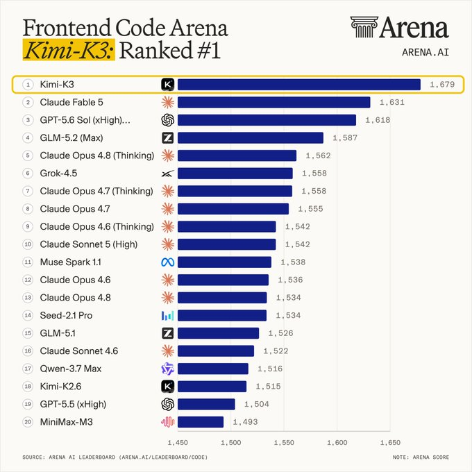
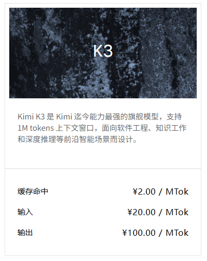
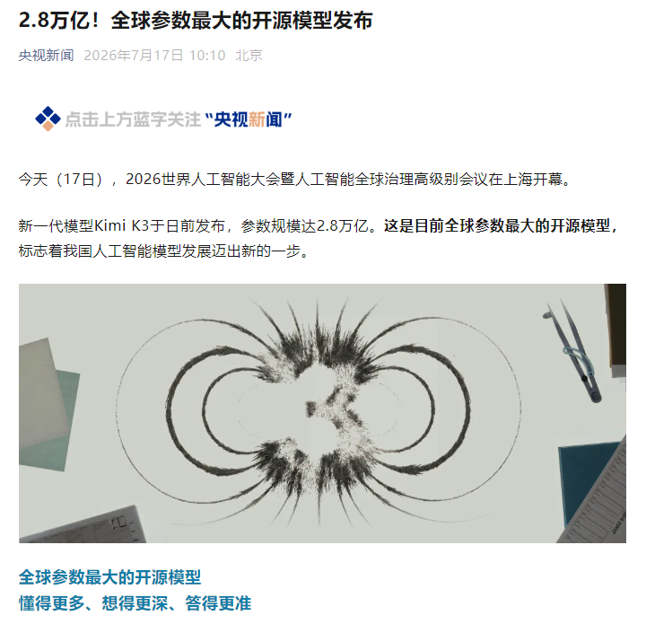
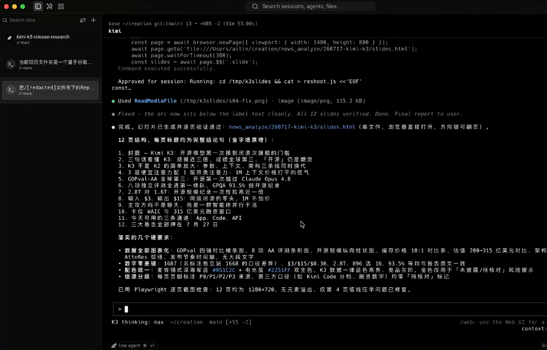

## 央视罕见报道一个 AI 模型

2026 年 7 月 16 日晚，月之暗面正式上线了新一代旗舰模型 Kimi K3。这件事本身在 AI 圈已经够热闹了——但真正让出圈的，是央视也下场做了报道。

一个国产大模型，能被央视点名宣传，这待遇可不多见。上一次还是 DeepSeek 火出圈的时候。

但这次不一样的是，Kimi K3 不是靠"国产情怀"上的央视，而是靠实打实的硬实力——**2.8 万亿参数、1M 上下文窗口、代码能力全球登顶**，每一项拎出来都能让国外顶级模型紧张一下。

## 2.8 万亿参数：国产模型的体量天花板

Kimi K3 的参数量达到了 **2.8 万亿（2.8T）**，这是什么概念？目前 OpenAI 的 GPT-5.2、Anthropic 的 Claude Fable 5，参数量都在万亿级别。K3 直接把国产模型的体量拉到了同一梯队。

参数大不等于一切，但参数大意味着模型的"脑容量"更大，能记住更多上下文，能处理更复杂的推理链路。K3 的上下文窗口支持最高 **100 万 token**，相当于一次读完整部《三体》三部曲还有余。

实际体验中，你可以把一整个代码库扔给它分析，把几十页的研报丢给它做总结，把上百轮对话的上下文都喂给它——它都能接住，不丢信息。

## 编程能力全球第一：超越 Claude Fable 5

Kimi K3 最硬的成绩，是在 **Front End Code Arena** 上拿下了全球第一——1679 分，正式超越了 Anthropic 的 Claude Fable 5。

如果你不知道这个含金量有多大，简单说一下：Code Arena 是全球开发者用真实编程任务投票出来的排行榜，不是实验室跑分，是实战成绩。Claude Fable 5 之前一直霸占这个榜单榜首，被所有程序员视为"写代码最强的 AI"。

现在，K3 把它拉下来了。

在 Artificial Analysis 的综合能力排行榜上，K3 同样冲进了全球前三，距离第一名只差 2 分。也就是说，在综合能力这个维度上，K3 已经和全球最顶尖的模型站在了同一条线上。

## 不止会写代码：游戏、PPT、智能体集群

如果你以为 K3 只是个"代码模型"，那就太小看它了。月之暗面给 K3 的定位是——**专为智能体编程与知识工作打造**。

K3 能做什么？

- **构建可玩的多人与 3D 游戏**：不是生成代码片段，是直接给你一个能玩的游戏
- **生成咨询级 PPT**：不是丑陋的模板，是能直接拿去汇报的专业级幻灯片
- **Swarm 智能体集群**：多个 AI 智能体协同工作，并行处理多个子任务
- **Goal 模式**：你给一个目标，K3 自己拆解步骤、调用工具、完成全链路任务

这意味着 K3 不再只是一个"你问我答"的聊天机器人，而是一个能干活的智能体。你告诉它"帮我做一个表情包小程序"，它能从写代码到部署全流程自己搞定。

## 从 App 到 API：全平台同步上线

K3 的发布是全量发布，不是灰度测试：

- **kimi.com 网页版**：打开就是 K3，首页标语已换成"K3 上线，专为智能体编程与知识工作打造"
- **Kimi App**：手机端同步升级
- **API 开放平台**：开发者可以直接调用 K3 的 API，支持 1M token 超长上下文、多模态理解、Tool Calling
- **Kimi Code**：专为开发者提供的代码服务，同时提供 K3 和 K2.7 Code 两个模型

从普通用户到开发者，从聊天体验到 API 调用，一次性全开放。这种"直接全线铺开"的发布方式，也侧面说明了月之暗面对 K3 性能的信心——不需要小心翼翼地灰度测试，直接放出来打。

## 开源：K3 对 AI 行业的真正贡献

如果说性能超越只是让 K3 站上擂台，那开源才是它真正改变格局的杀手锏。

K3 是一个 **2.8 万亿参数的开源模型**。这意味着什么？它的权重对全世界开放，任何研究者、开发者、企业都可以下载、研究、微调、部署。

对比一下当前 AI 领域的格局：

| 模型 | 参数量 | 开源 | 能否本地部署 | 能否自由微调 |
|------|--------|:---:|:---:|:---:|
| Kimi K3 | 2.8T | ✅ | ✅ | ✅ |
| Claude Fable 5 | ~2T | ❌ | ❌ | ❌ |
| GPT-5.2 | ~3T | ❌ | ❌ | ❌ |

OpenAI 和 Anthropic 的模型能力确实强，但它们是黑箱——你只能通过 API 调用，看不到模型内部结构，不能修改，不能本地部署，更不能在自己的数据上微调出一个专属版本。你的数据、你的业务逻辑、你的核心竞争力，全都攥在别人的 API 手里。

K3 改变了这个局面。一个 2.8T 参数的旗舰模型开源，意味着：

**对学术界**——研究者可以拆开这个 2.8T 参数的"超级大脑"一探究竟，研究它是怎么训练的、推理链路怎么构建的、知识怎么编码的。以前这种规模的开源模型几乎没有，K3 给了全球研究者一个绝佳的研究对象。

**对企业开发者**——你可以在自己的服务器上部署 K3，数据不出域，安全可控。你可以在自己的行业数据上微调，训练出一个"懂你行业"的专属模型。不依赖任何 API，不受任何限制。

**对整个 AI 生态**——开源模型是基础设施。就像 Linux 之于操作系统、Android 之于移动端，一个高性能的开源大模型会成为无数应用的基础底座。K3 让这个底座达到了"全球前三"的水平。

月之暗面选择把 K3 开源，不是一个慈善举动，而是一种战略判断：当你的模型足够强，开源反而比闭源更有价值——因为生态比模型本身更值钱。每一个基于 K3 构建的应用、每一个在 K3 上做的研究、每一个微调出来的行业模型，都在加固月之暗面的生态壁垒。

这才是 K3 对 AI 发展最大的贡献：**它把"全球顶级模型"从少数公司的私有财产，变成了整个行业的公共基础设施。**

## 央视为什么选了 Kimi？

央视报道 AI 模型，从来不是看谁热度高就报谁。能让央视下场的，是那些真正代表"国家级技术突破"的事件。

Kimi K3 的意义在于：

**第一，这是国产模型首次在全球编程能力排行榜上登顶。** 以前我们说"国产模型追赶国外"，总是带着"还差一点"的遗憾。这次 K3 不是追赶，是超越——在开发者最看重的编程能力上，直接干到了世界第一。

**第二，2.8 万亿参数开源，打破了顶级模型的垄断。** OpenAI 和 Anthropic 把最强大的模型锁在 API 后面，K3 把同等水平的模型开源给全世界。这不是追赶，是降维打击——你闭源收费，我开源免费，还比你强。

**第三，K3 的定位是"智能体"，踩中了 AI 的下一个风口。** 全球 AI 行业正在从"对话模型"转向"智能体"，K3 从设计之初就是为智能体场景优化的，这是前瞻性的判断。

## 国产模型的"赶超时刻"

回顾国产大模型的发展路径，会发现一条清晰的加速曲线：

2024 年初，Kimi 以长文本能力出圈，那时候还是"国产模型能用"的阶段。

2025 年，K2.6 开源，在多个 benchmark 上接近 GPT-5 级别，进入"国产模型好用"的阶段。

2026 年 7 月，K3 上线，2.8T 参数、编程能力全球第一、综合能力全球前三——正式进入"国产模型超越"的阶段。

从"能用"到"好用"再到"超越"，只用了两年半。这个速度，在全球 AI 发展史上都是罕见的。

## 免费体验，人人可用

K3 目前在 kimi.com 上免费开放体验，手机 App 同步更新。注册就能用，没有等待名单，没有付费墙。

如果你是开发者，还可以通过 Kimi Code 或 API 平台直接调用 K3。1M 上下文 + Tool Calling + 多模态，这意味着你可以构建真正复杂的应用——从代码助手到数据分析到自动化工作流，K3 都能支撑。

---

央视这次报道的不是一个模型，是一个信号：国产 AI 已经不需要"国产"这个前缀来获得关注了。它的实力，足以和全球最顶尖的模型正面竞争。

Kimi K3，值得试一试。打开 kimi.com，亲自感受一下"全球第一"的编程能力到底是什么水平。
