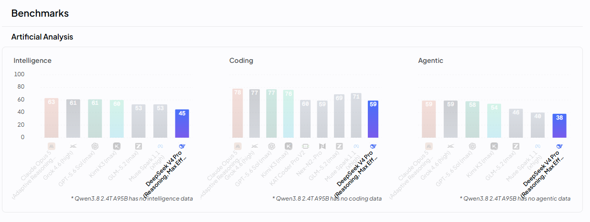

先说结论：**8 月 12 日深夜到 13 日凌晨（北京时间），短短 39 分钟内，两个国产 GA 正式旗舰几乎同时上线。**

不是预览版，不是 beta，是直接上生产、开放给全球开发者调用的正式商用版。

而且，它们来自两个不同的团队——深度求索和阿里通义千问。

这意味着什么？**中国的大模型竞赛，已经从"单点突破"变成了"集团军作战"。**

下面把两个模型掰开揉碎了讲，再聊聊它们背后那个更大的问题：国产模型，到底在世界舞台上站到了什么位置。

## 一、两个 GA 旗舰，同一天上线

先看 OpenRouter 上的权威规格（这是全球模型聚合平台，数据直接来自官方）：

| | **DeepSeek V4 Pro 0813** | **Qwen3.8 2.4T A95B** |
|---|---|---|
| 性质 | DeepSeek V4 Pro 的 **GA 正式版** | Qwen3.8 Max 旗舰的**开源权重版** |
| 架构 | 大规模稀疏 MoE | 稀疏 MoE，**2.4 万亿总参 / 950 亿激活** |
| 上下文窗口 | **100 万 Token**（1,048,576） | 256K（262,144） |
| 最大输出 | 384K Token | 52K Token |
| 输入价格（每百万 Token） | **$0.435** | $2.0 |
| 输出价格（每百万 Token） | **$0.87** | $6.0 |
| 上线时间 | 2026-08-12 15:42 UTC | 2026-08-12 16:21 UTC |

**两个细节值得划重点：**

### 1. DeepSeek 的价格，低到离谱

V4 Pro 0813 每百万 Token 输入 **$0.435**、输出 **$0.87**。

什么概念？看看全球旗舰现在的行情（OpenRouter 数据）：

- OpenAI GPT-5.6（terra）：$1.0 / $6.0
- Google Gemini 3.1 Pro：$2.0 / $12.0
- Anthropic Claude Opus 5：$5.0 / $25.0

DeepSeek V4 Pro 0813 的 $0.435 / $0.87，**比最便宜的 GPT-5.6 还便宜一半多，比 Claude Opus 5 便宜 11 倍**。

而且这还不是最狠的——DeepSeek 还有 **V4 Flash**（284B 总参 / 13B 激活），百万 Token 输入只要 **$0.08**、输出 **$0.18**，比 GPT-5.6 便宜约 12 倍。这个价格，全球没有第二家能给。

**翻译成人话：用 DeepSeek，你可以用别人十分之一的钱，跑出差不多的效果。**

### 2. Qwen 选择了"开源"这条路

Qwen3.8 2.4T A95B 是 Qwen3.8 Max 旗舰的**开源权重版本**。

注意这个策略：阿里的旗舰 Max 是闭源商用的（还带多模态，能看图看视频），但**把它的"身体"——2.4 万亿参数的开源版——放了出来**，让全球开发者免费用、免费改。

**2.4 万亿参数，已经是开放权重模型里的巨无霸级别——目前 OpenRouter 上架的开放权重模型中，只有月之暗面的 Kimi K3（2.8 万亿参数）比它更大。前两名，全是中国的。**

## 二、放到世界坐标系里：我们走到了哪？

光看参数和价格不够，得放到全球牌桌上看。

### 牌桌一：价格战，国产已经赢了

大模型竞争，到最后拼的是"性价比"。谁的模型能力强、价格还低，谁就能占领开发者的钱包。

看这张表就懂了：

- OpenAI GPT-5.6（terra）：$1.0 / $6.0
- Google Gemini 3.1 Pro：$2.0 / $12.0
- Anthropic Claude Opus 5：$5.0 / $25.0
- **DeepSeek V4 Pro 0813：$0.435 / $0.87**
- **DeepSeek V4 Flash：$0.08 / $0.18**

**国产模型在"单位智能的价格"这个维度上，已经是全球最低，没有之一。**

这不是"便宜没好货"——恰恰相反，是因为 MoE 稀疏激活架构 + 自研训练框架 + 自建智算集群，把成本真正打了下来。

### 牌桌二：上下文窗口，跻身"1M 俱乐部"

- DeepSeek V4 Pro 0813：**100 万 Token**（最大输出 384K）
- Qwen3.8 Max（旗舰）：**100 万 Token**

百万上下文意味着什么？一次性喂进去一整套代码库、一整本书、几百页合同，模型都能记住。

现在全球第一梯队已经普遍进入 1M 俱乐部：GPT-5.6 系列 1.05M、Claude Opus 5 1M、Gemini 3.1 Pro 1M，Grok 4.20 甚至做到了 2M。**国产双旗舰与全球顶级选手站到了同一条线上——这在两年前是不敢想的。**

### 牌桌三：开源生态，国产成了"全球基建"

这是最容易被低估、但其实最厉害的一点。

**DeepSeek 全系 MIT 协议开源，Qwen 从 1.8B 到 2.4T 全系开源。**

这意味着全球开发者——包括硅谷的团队——在搭自己的 AI 应用时，越来越多直接拿国产开源模型当地基。不是因为它便宜，是因为**能力真的够用了，而且能自己掌控**。

当一个国家的模型成为全球开发者的"默认选择"，这就不只是技术领先了，是**生态主导权**。

### 牌桌四：硬实力基准测试——差距要认，但别看扁了

价格和生态说完，最硬的问题来了：**纯论模型能力，国产跟世界顶级差多少？**

OpenRouter 的模型页内嵌了 Artificial Analysis 的三大基准指数（Intelligence 智能、Coding 编程、Agentic 智能体，满分 100），这是目前业界引用最多的独立评测之一。直接放图：

把图里的数字整理成表（均为各模型最高推理档位）：

| 模型 | 智能 | 编程 | 智能体 | 价格 $/M（输入/输出） |
|---|---|---|---|---|
| Claude Opus 5 | **63** | **78** | **59** | $5 / $25 |
| Grok 4.6 | 61 | 77 | 59 | $2 / $6 |
| GPT-5.6 Sol | 61 | 77 | 58 | $5 / $30 |
| **Kimi K3** | 60 | 76 | 54 | $3 / $15 |
| Muse Spark 1.1 | 53 | 71 | 40 | $1.25 / $4.25 |
| GLM-5.2 | 53 | 69 | 46 | $0.5 / $3.15 |
| **DeepSeek V4 Pro 0813** | 45 | 59 | 38 | **$0.435 / $0.87** |

> Qwen3.8 2.4T A95B 今天刚上线，三项基准都还没有数据。图中另有 KAT Coder Pro V2（编程 60）、Nex-N2-Pro（编程 59）两个编程专项模型，篇幅所限不列入。

三个看点，一个比一个有意思：

**1. 绝对能力的第一梯队，目前还是美国三巨头。** Claude Opus 5 三项全部第一，GPT-5.6 Sol 和 Grok 4.6 咬得很紧。这个差距要认，吹牛没用。

**2. 但 Kimi K3 已经摸到了天花板。** 智能 60 对 63、编程 76 对 78、智能体 54 对 59——三项全部全球前四，和榜首只差 2~5 分。这不是代差，是一两个版本的距离。上个月 Kimi K3 发布时央视罕见下场报道（当时我写过一篇[《央视下场宣传国产模型，Kimi K3真有实力，赶超国外顶级模型！》](../cctv-kimi-k3-frontier-model/)），现在拿基准数据一对，确实站在了第一梯队的门槛上。

**3. DeepSeek V4 Pro 0813 分数不高，但它打的根本不是这场仗。** 45/59/38 看着落后，但看最后一列价格：$0.435/$0.87，是 Claude Opus 5 的 1/10 到 1/30。DeepSeek 的算盘很清楚——**用十分之一的价格，给你七八成的能力**。对企业批量调用、Agent 流水线这种"按 Token 烧钱"的场景，这笔账算下来，DeepSeek 反而是王者。

**一句话看懂这张表：论"绝对最强"，国产还差一口气；论"够用且便宜"，国产已经把桌子掀了。**

## 三、为什么是现在？三个变量同时到位

国产模型能在 2026 年夏天集体爆发，不是偶然，是三个变量凑齐了：

### 1. MoE 稀疏架构：参数大 ≠ 贵

2.4 万亿、1.6 万亿看着吓人，但因为是稀疏激活的 MoE，每次推理只激活一小部分参数。

就像雇了一个 2 万人的专家团队，但每次只用其中几十个人干活——**能力是专家级的，成本是白菜价的**。

### 2. 自研训练框架 + 自建智算集群

深度求索公开讲过：靠自研训练框架 + 自建智算集群 + 万卡算力，半年时间出了多个百亿级模型。

**最卡脖子的 GPU 问题，被"怎么用最少的卡训出最好的模型"这个工程能力绕过去了。**

### 3. 开源 + 低价的飞轮

开源 → 全球开发者用 → 反馈改进 → 模型更强 → 更多人用 → 场景落地更多。

国产团队把这个飞轮转得比谁都快，价格又低到中小企业也敢上。

## 四、清醒的一面：差距还在

吹完了，也得说点冷静的。

### 差距一：底层硬件

模型很强，但训练这些模型的卡，大部分还是别人的。GPU、先进芯片的供应链，这条腿还没真正长出来。

### 差距二：应用生态

模型强 ≠ 应用强。ChatGPT 之所以是 ChatGPT，不只是模型，还有 API 生态、插件体系、开发者工具链、企业集成。这些"软基建"，国产还在补课。

### 差距三：原创范式

DeepSeek、Qwen 很强，但主体仍是**在 Transformer 这条路上把工程做到极致**。能不能像当年 GPT、Constitution AI 那样**定义下一个范式**？还没看到。

## 五、写在最后：从"追赶"到"并跑"，部分领域已经"领跑"

回到开头那句话——**39 分钟内，两个国产 GA 旗舰几乎同时上线。**

这件事的象征意义，比模型本身更大：

- **价格**：V4 Pro 0813 是 OpenRouter 上当前最便宜的旗舰级模型 ✅
- **长上下文**：1M 俱乐部，与全球顶级并跑 ✅
- **开源生态**：全球前二的开放权重模型（Kimi K3 2.8T、Qwen3.8 2.4T）都是中国的 ✅
- **绝对能力**：Claude Opus 5 仍是三冠王，但 Kimi K3 已追到 2~5 分之差 ⏳
- **底层硬件 / 应用生态 / 原创范式**：还在追赶 ⏳

**一句话总结：论绝对能力，国产已经摸到第一梯队的后背；论价格、长上下文、开源生态这三张牌，国产已经是领跑者。**

对开发者来说，这是最好的时代——

- 想要最强推理 + 超长上下文 + 极致低价？**DeepSeek V4 Pro 0813**
- 想要开源可控 + 超大参数 + 自己部署？**Qwen3.8 2.4T A95B**
- 想要国产最强硬实力 + 开源 + 编程？**Kimi K3**（$3/$15，三项基准全球前四）
- 想要多模态（看图看视频）？**Qwen3.8 Max**

一个健康的技术格局，从来不该只有一家独大。**国产模型站上世界牌桌中央，对整个行业、对每一个开发者，都是好事。**

---

👉 **关注【虾大师】公众号，回复「国产模型」获取 DeepSeek / Qwen 全模型选型对比表 + 免费 API 体验链接。**

> 数据来源：OpenRouter 官方模型 API（2026-08-13 抓取）。
