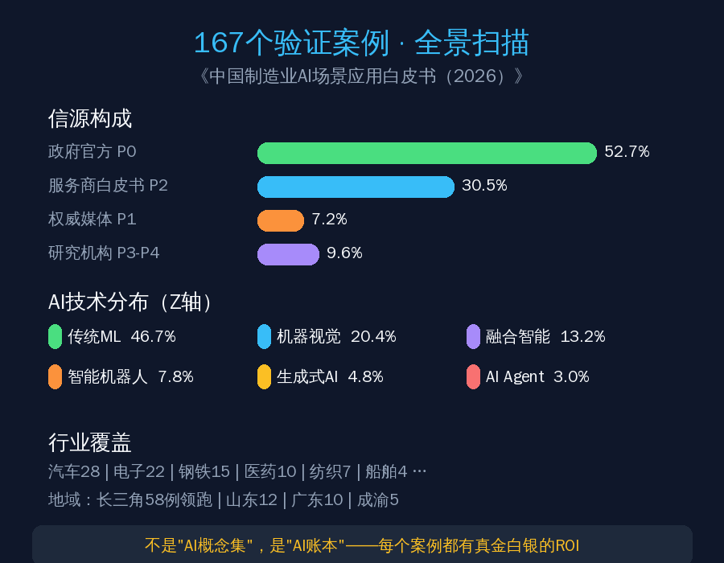
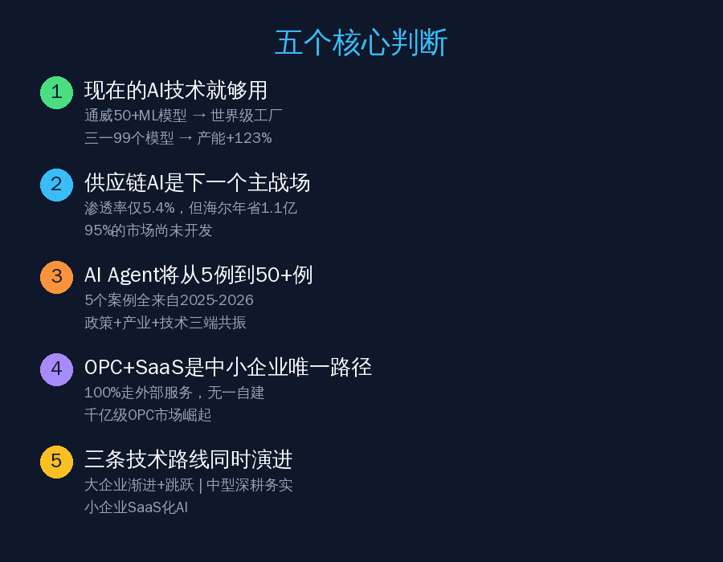
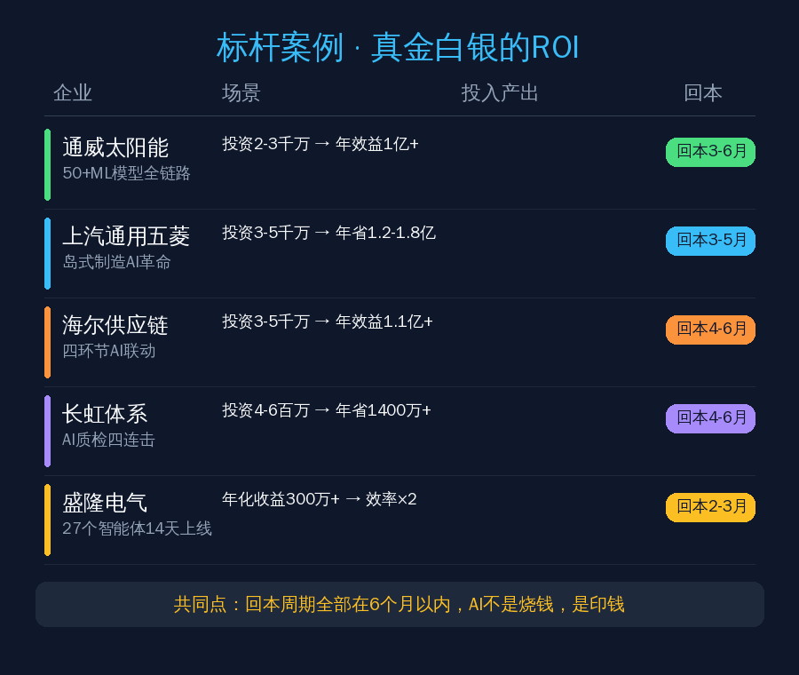
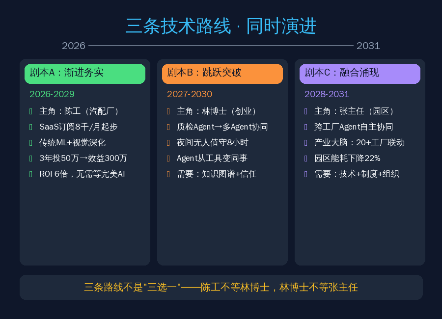

前几天拿到一份56页的《中国制造业AI场景应用白皮书（2026）》，基于167个经过严格验证的真实案例，不是PPT吹牛，是实打实的投入产出数据。

看完之后我最大的感受就一句话：**中国的制造业AI，不是"未来时"，是"现在进行时"。**

今天用大白话给你拆解这份白皮书里最值钱的干货。

## 一、167个案例，到底说了什么？

先说这份白皮书的"含金量"。

167个案例，不是随便从网上扒的。筛选标准极其严格：

- **来源可靠**：52.7%来自政府官方文件（工信部、省工信厅、世界经济论坛灯塔工厂），30.5%来自服务商白皮书，7.2%来自权威行业媒体
- **企业可查**：不用"某企业""某集团"这种匿名表述，全部真名实姓
- **数据可量化**：每个案例至少有一个可验证的数字——效率提升多少、成本降了多少、良率提高了多少
- **场景可描述**：不是泛泛而谈"智能化转型"，而是具体到哪个环节、用了什么技术、怎么做的

覆盖12个行业：汽车28例、电子22例、钢铁15例、医药10例、纺织7例……长三角58例领跑全国。

一句话总结：**这不是"AI概念集"，是"AI账本"。**

## 二、五个核心判断，条条扎心

白皮书提炼了五个核心判断，我逐个给你翻译成人话。

### 判断1：现在的AI技术就够用

很多人觉得AI还不够成熟，想再等等。

白皮书直接打脸：**不需要等"完美AI"。**

通威太阳能，50多个传统机器学习模型嵌入生产全链路，电池转换效率提升12%、缺陷率降41%、成本降37%、碳排放降33%。注意，用的不是什么前沿大模型，是"传统ML"。

三一重工18号工厂，99个ML模型，产能扩大123%。

白皮书原话特别到位：**"传统ML做到极致就是先进。"**

问题从来不是"技术不够好"，而是"你有没有找到对的场景和对的方式"。

### 判断2：供应链AI是下一个主战场

167个案例里，供应链域只占5.4%——9个案例。

但这9个案例的ROI高得吓人：

- 海尔供应链全链路AI：库存周转率+60%、物流成本-25%，年综合效益超1.1亿元
- 南钢峰谷发电AI调度：年增发电655万度，效益增4.24倍
- 柳药物流AI排线：排车从小时级缩短到分钟级

**5.4%的渗透率意味着95%的市场还没人碰。** 这是未来3年最大的结构性机会。

### 判断3：AI Agent将从5例到50+例

167个案例里只有5个AI Agent案例，占比3.0%。

但关键信号是：**这5个全部来自2025-2026年的最新实践。**

SAP在ERP里嵌了200多个Joule Agent场景，PTC搞了多智能体协同，工业富联做了GenAI设备助手，海尔重庆上了GenAI维修助理。

政策端（三部门《智能体规范应用与创新发展实施意见》）、产业端、技术端三端共振。2026-2028年，AI Agent将迎来批量部署。

**这不是"Agent不重要"的信号，是"即将爆发"的信号。**

### 判断4：OPC+SaaS是中小企业的唯一可行路径

167个案例中约10%来自中小企业。它们的AI路径有一个共同点：**无一自建AI基础设施，100%走SaaS或外部服务商。**

投入几万到几十万，几个月见效。

这预示着一个千亿级OPC（一人公司）服务市场的崛起——大厂不愿碰、小厂不会做的"中间市场"，正好是懂行的个人或小团队的天下。

### 判断5：三条技术路线同时演进

制造业不是铁板一块：

- **大企业**：渐进+跳跃并行，产线质检用传统ML，排产研发试点AI Agent
- **中型企业**：深耕"渐进务实"，传统ML+视觉质检就够创造6倍ROI
- **小企业**：拥抱SaaS化AI，不建系统，直接订阅，瞄准单场景快赢

三条路线都有自己的合理性和时间窗口。不用互相等。

## 三、标杆案例：真金白银的ROI

白皮书里有10个深度专栏案例，我挑几个最震撼的。

### 通威太阳能：50个"小模型"堆出世界级工厂

不是一个超级AI，是50多个ML模型各管一摊：工艺优化、缺陷分析、预测维护……每个模型可能只提升1%，但50个叠加就是质变。

累计AI投资约2000-3000万元，年综合效益超1亿元，**回本周期3-6个月**。

### 上汽通用五菱：岛式制造的AI革命

从"流水线固定节拍"变成"每辆车走自己的路径"。华为星河AI网络+AGV多机协同调度。

交付周期-30%、新品上市从420天缩到240天、成本降5%-8%、能耗降25%。

投资约3000-5000万，年节省1.2亿-1.8亿，**回本周期3-5个月**。

### 海尔供应链：四个环节联动，年省1.1亿

| 环节 | 效果 | 年效益 |
|------|------|--------|
| 需求预测（精度95%） | 减少缺货和过剩 | 2000万+ |
| 库存管理（周转+60%） | 释放资金占用 | 5000万+ |
| 生产排程（响应×2） | 减少插单成本 | 1500万+ |
| 物流调度（运费-25%） | 直接成本节省 | 3000万+ |

总投入约3000-5000万，**回本周期4-6个月**。

### 长虹体系：AI质检四连击

碱性电池钢壳检测漏液率降到0.7PPM，年省660万；电子AOI+AI直通率+20%，人员减少87.5%，年省400万+……四个场景投资400-600万，年节省1400万+，**回本4-6个月**。

### 盛隆电气：27个智能体，14天上线

引入慧工云工业智能体矩阵，14天完成27+智能体部署，覆盖生产排产、质量检验、采购协同、仓储管理。年化收益300万+，减少60%重复性协同时间。

**从"数字化转型规划半年起步"到"智能体两周见效"。**

## 四、中小企业：5万块就能起步

这是白皮书里最让我兴奋的部分。

6个中小企业标杆案例的ROI对比：

| 企业 | 场景 | 年投入 | 年效益 | 回本周期 |
|------|------|--------|--------|----------|
| 义乌优克拉 | AI全流程 | 5-8万 | 30-50万 | 2-3个月 |
| 宁波怡盛液压 | AI排程 | 3-5万 | 15-25万 | 3-4个月 |
| 浙江高格 | AI质检 | 5-8万 | 20-30万 | 3-5个月 |
| 宁波创元信息 | AI模具设计 | 8-12万 | 40-60万 | 2-3个月 |
| 深圳智能硬件 | AI工作流 | 2-3万 | 8-15万 | 2-4个月 |
| 浙江汽配 | AI全检 | 8-15万 | 30-50万 | 3-6个月 |

看到没？**回本周期普遍2-6个月**，远短于大企业的6-24个月。

为什么？因为投入小（不建基础设施）、见效快（SaaS即开即用）、场景聚焦（只做一件事）。

白皮书总结的中小企业AI特征：

- 技术选型：单点突破，选1个场景
- 基础设施：零自建，全部SaaS或外部服务
- 团队要求：无需AI人员，OPC或SaaS即可
- 实施周期：1-4周

**不是"用不起AI"，是"你还没找到那个5万块就能解决的痛点"。**

## 五、三个未来剧本：2026-2031

白皮书用情景规划法推演了三种未来，特别有意思。

### 剧本A：渐进务实（2026-2029）

主角是浙江汽配厂的陈工，45岁，工厂300人，年营收3亿。

2026年10月，他花8000块/月订了个SaaS化AI视觉质检，第一个月良率从96%提到98.5%。他在晨会上说："这8000块比多招两个质检员值。"

到2029年，三年总投入约50万，直接效益超300万，**ROI约6倍**。

没有一项是"全自动"的，但每一项都在帮他"想得更快、判得更准"。

### 剧本B：跳跃突破（2027-2030）

主角是林博士，38岁，前互联网大厂AI研究员，辞职创业做制造业AI Agent，团队4人。

2027年，他给一家家电厂做了"质检Agent"——不只检测缺陷，还能推理根因、生成报告。质检主管说："第一次感觉是个'同事'在帮我，不是个'工具'。"

2029年，他的客户工厂首次实现"夜间无人值守"——三个Agent自主协同运行8小时。老板说："我不是省了几个夜班工人的工资，我是多了一条8小时的产能。"

### 剧本C：融合涌现（2028-2031）

主角是某省级工业园区的张主任。

2028年，园区里A工厂的AI Agent检测到原料波动，自动向B工厂（上游供应商）发送质量预警，B工厂的Agent自动调整工艺参数。两家工厂的采购经理都没介入。

张主任说："我们现在管的不是工厂，是一个'会思考的产业链'。"

2031年，园区能耗下降22%——不是某家工厂做得好，是整个园区的能源调度AI在20家工厂之间动态调配。

**三个剧本不是"三选一"，是同时演进。** 陈工不需要等林博士的Agent成熟，林博士也不需要等张主任的产业大脑建成。

## 六、五个致命误区，30%的失败率都栽在这

白皮书专门列了五个常见误区，我觉得每个制造业老板都该看看：

**误区1："数据够了再开始"**

等数据治理完成、等数据中台建成、等所有设备联网……几年过去了，AI还没启动。

真相：通威第一个ML模型只用了3个月的数据。正确做法是用现有数据跑通第一个场景，用效果说服投入。

**误区2："AI必须全自动"**

要求AI质检100%替代人工、要求AI排产全自主。

真相："AI建议+人确认"才是未来3-5年的主流。长虹的"一人多机"也不是全自动——人仍在监督和兜底。

**误区3："用大模型解决一切"**

167个案例中，传统ML占46.7%，机器视觉占20.4%，生成式AI仅4.8%。制造业最需要的往往是机器视觉和时序预测，不是大模型。

**误区4："AI项目交给IT部门就行"**

成功的AI项目全部是"业务驱动+IT支撑"。通威50+用例全部由工艺工程师提出需求。AI项目必须是业务负责人负责，IT是技术支撑。

**误区5："AI部署完就完事了"**

模型上线→验收→完事？数据漂移会让准确率持续下降。AI不是一次性项目，是持续的服务。

## 七、你的行动清单

白皮书最后给了五类角色的行动建议，我提炼最核心的：

**如果你是制造企业：**

- 2026年：选一个成熟场景（质检/预测维护），SaaS化部署，6个月内见成效
- 2027年：扩展到2-3个场景
- 2028年：在有数据积累的基础上，试点AI Agent或排产优化
- 首年预算：大企业500-2000万，中型50-300万，小型5-30万

**三个"不要"和一个"一定"：**

- 不要等数据完美了再开始
- 不要从最难的地方切入
- 不要追求"全自动"
- 一定要找到对的服务商——**懂你的行业 > 技术炫酷**

**如果你想做OPC创业：**

黄金公式：**行业经验 × AI工具能力 = 核心竞争力**

起步三步：
1. 在一个细分行业找到一个高价值AI场景（1个月）
2. 用SaaS+大模型做最小可用版本，免费给3个客户试用（2-3个月）
3. 定价收费，复制到同行业更多客户（3-6个月）

三个"千万别"：千万别只做一个客户的专属定制、千万别同时服务5个行业、千万别自研AI基础框架。

## 写在最后

这份白皮书最打动我的一句话是：

> 不是技术不够好，是找到对的场景、对的方式、对的节奏。

167个案例证明，中国制造业AI已经过了"能不能用"的阶段，进入了"怎么用好"的阶段。

传统ML和机器视觉已经创造了可观的商业价值，AI Agent和供应链AI正在打开新一轮增长空间。

**你不需要等"完美AI"。你需要的是今天就开始的第一步。**

---

*本文基于《中国制造业AI场景应用白皮书（2026）》解读，白皮书由南京市企业数字化转型研究会等机构编撰，2026年6月正式发布。*

*关注公众号【虾大师】，回复"制造AI"获取白皮书完整版PDF。*
