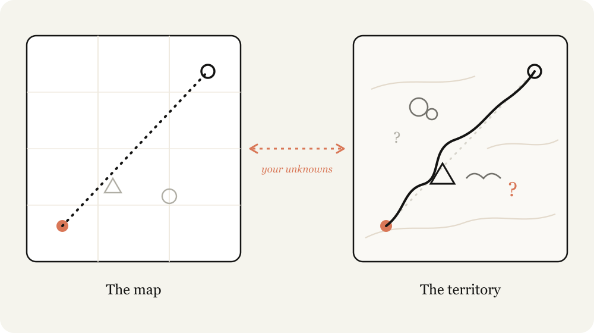
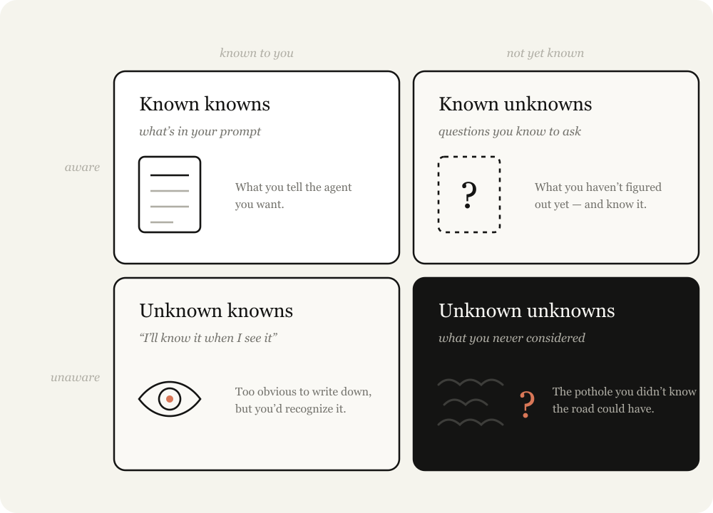
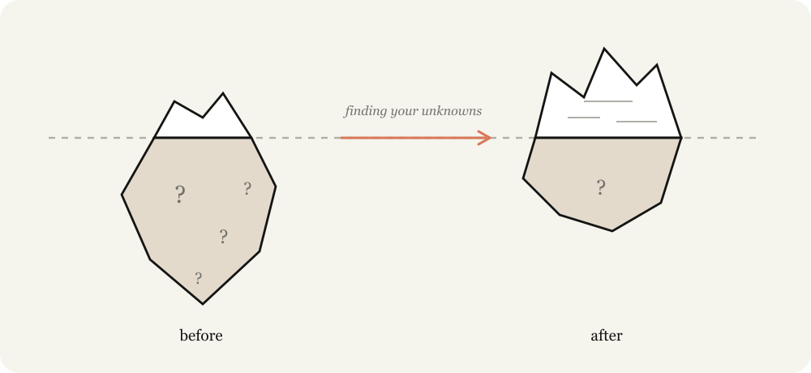

# AI大神教你玩Agent：如何全面发掘模型潜力

随着模型能力越来越强大，但你有没有发现——有时候给 Agent 发了一大段需求，它做出来的东西还是偏离你的预期？这不是模型不行，而是你还不会"问"。Claude 团队的 Thariq 在深度使用 Claude Code 后总结了一套方法论，虽然他讲的是 Claude Fable 5，但这套方法对所有 Agent 和模型都通用，非常值得学一学。

## 一句话核心：模型越强，方法越重要

跟强模型协作，真正的瓶颈不在模型能力，而在于你**澄清"未知"的能力**。你给 Agent 的提示词、技能、上下文是一张"地图"，但真实的代码库和业务约束是"疆域"。地图和疆域之间的差距，就是"未知"——Agent 撞上未知就只能靠猜，猜错了就是 bug。

要做的工作越多，可能遇到的未知就越多。所以，与其追求"完美提示词"，不如想办法提前发现自己的盲区。

## 四类未知：最怕的是"不知道自己不知道"

把问题拆成"是否意识到"×"是否掌握"两个维度，就得到四类未知：

| | **意识到** | **未意识到** |
|---|---|---|
| **已掌握** | **已知之已知** — 提示词里写清楚的，Agent 明确知道要做什么 | **未知之已知** — 显而易见但从没写下来，看到才认得出 |
| **未掌握** | **已知之未知** — 知道自己没想清楚，但至少意识到了 | **未知之未知** — 压根没考虑过，连"不知道"这件事都不知道 |

最危险的是右下角——**你不知道自己不知道**。最优秀的 Agent 编程者之所以厉害，不是因为他们什么都懂，而是因为他们和代码库、模型行为高度同步，"未知"相对更少。而减少未知、为未知做规划，这项能力是可以练出来的。

## 指令不是越详细越好

一个常见的误区：以为提示词写得越详细，Agent 就越听话。实际上：

- **太具体** → Agent 一板一眼照做，该转弯的时候也不转弯
- **太笼统** → Agent 套用通用最佳实践，未必适合你的实际场景

不给未知留余地，就会两头落空。正确做法是：交代你的起点——你思考到哪一步了、你对问题和代码库有多少经验——然后让 Agent 当你的"思维伙伴"，帮你更快发现那些你没意识到的盲区。

## 发现未知的三阶段工作流

Thariq 把整个协作过程分为三个阶段，每个阶段的核心都是同一件事：**在代价变高之前，廉价地发现自己不知道什么**。

### 实现之前（最关键的阶段）

- **盲点排查** — 直接请 Agent 帮你找出"你没想到的地方"，并解释给你听
- **头脑风暴与原型** — 用快速原型把那些"看到才认得出"的标准尽早显性化
- **访谈** — 让 Agent 一次问一个问题，优先问那些答案会改变架构的问题
- **参考资料** — 最好的参考是源代码，指向一个文件夹就行，跨语言也没问题
- **实现计划** — 聚焦最可能变动的部分：数据模型、类型接口、UX 流程

### 实现之中

- **实现笔记** — 记录偏离计划的决策，遇到边界情况选保守方案，记入"偏离清单"

### 实现之后

- **提案与说明** — 把原型、规格、笔记打包，获取认可和批准
- **测验** — 让 Agent 反过来考你对改动的理解，通过了再合并

## 真实案例：用 Agent 剪视频

Thariq 自己不懂视频剪辑，他是怎么用 Claude Code 完成视频制作的呢？

1. 先问 Agent 语音转文字（Whisper）的原理和 ffmpeg 的精度 → 消除了"不知道自己不知道"的部分
2. 用 Remotion + 转录做原型 → 验证 UI 和语音同步是否可行
3. 让 Agent 教他调色 → 发现自己连"什么算好"的标准都不知道，于是先学习再选择

这个案例最有意思的地方在于：他不是一开始就规划好所有步骤，而是从已知出发，在做的过程中不断发现新的未知，然后逐个消除。

## 总结

当一个长周期任务返回的结果不对，多半不是模型不行，而是你没有花足够的时间去界定未知，或者没有制定一个让你和 Agent 能共同适应的实现计划。每一次说明、头脑风暴、访谈、原型、参考资料，都是在代价变高之前廉价发现未知的手段。

所以，开启下一个项目时，先让 Agent 帮你找出你的未知。

---

原文在 Claude 的博客上，需要科学上网。为了方便大家学习，我已转换为 PDF 电子书，并翻译了中文版，如需获取，在公众号回复关键字 `fable` 即可获取网盘下载链接。
