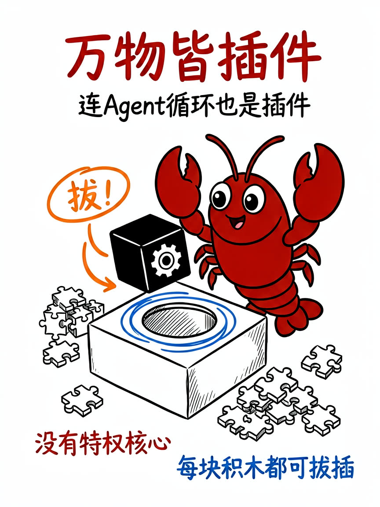
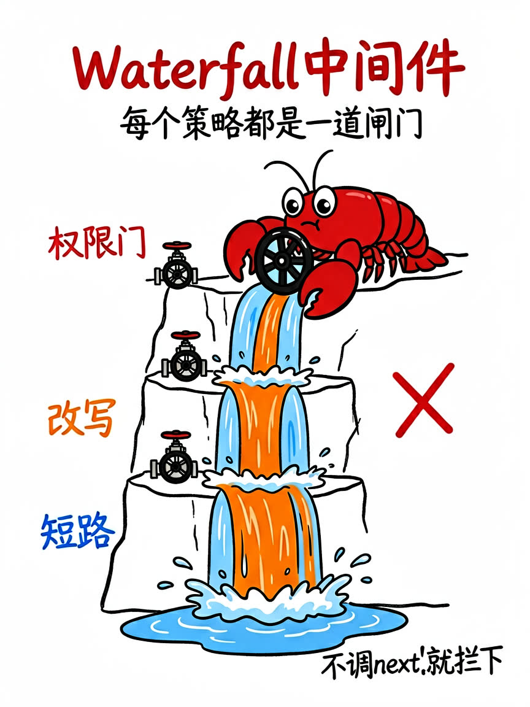
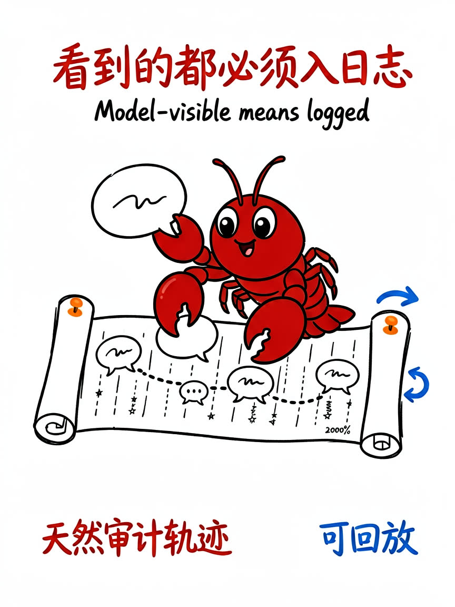
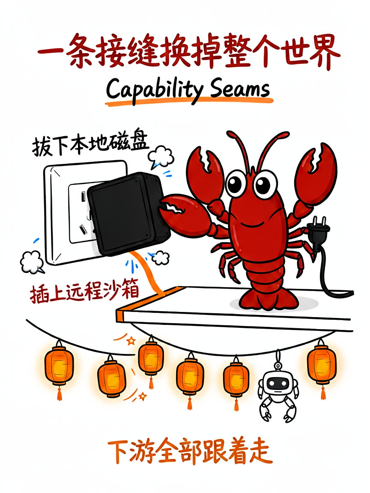

8 月 13 号，DeepSeek 悄悄上线了一个叫 **DeepSeek Harness**（简称 dsh）的开源项目。15 天后，它的 GitHub star 数突破了 **20 万**。

20 万 star 是什么概念？很多明星开源项目攒好几年才到这个数。而 dsh 只用了半个月。

好奇心驱使我把它完整克隆下来翻了一遍：**27 万行 TypeScript 源码、254 个包、978 个测试文件、237 篇文档**。看完之后我只有一个感受——这帮人是真的把「插件化」这件事做到了骨头里。

这篇文章就是我啃完源码后的结论整理。不堆术语，尽量讲人话。如果你也在关注 AI Agent 框架，或者想给公司搭一个「数字员工平台」，这篇值得读完。

## 先搞清楚：DeepSeek Harness 是什么？

一句话：**一个开源的 AI Agent 运行框架**。

你可以把它理解成「Agent 的操作系统底座」。你在命令行敲一句 `npx @deepseek-ai/dsh web`，它就会在本地起一个网页工作台，你在这里跟 AI 对话、让它执行任务、调用工具——表面上看起来跟 Claude Code 这类产品差不多。

但 dsh 真正的野心藏在它的口号里：

> **Everything is a Plugin —— 万物皆插件。**

这不是营销文案。我把源码翻完以后发现，他们是字面意思：**产品里的每一个部分都是插件，包括模型适配、工具注册、会话日志，甚至 Agent 循环本身**。

下面这六个结论，是我从源码和官方文档里一条条挖出来的。

## 结论一：真·微内核——连 Agent 循环本身都是插件



大多数号称「插件化」的框架，内核里都藏着一个不能动的核心——Agent 主循环通常就写死在内核里，插件只能挂在旁边打打下手。

dsh 不是这样。官方文档里有句原话，我觉得值得抄下来：

> Every part of the product is a plugin, including the model adapter, the tool registry, the session log, and **the agent loop itself**, so each is replaceable from configuration. There is no privileged core to patch.
>
> （产品的每个部分都是插件，包括模型适配器、工具注册表、会话日志，以及 Agent 循环本身——每一个都能通过配置替换。不存在需要打补丁的特权核心。）

注意最后半句：**没有特权核心**。

这意味着什么？你想给 Agent 换一套完全不同的执行逻辑（比如换成规划优先的模式），不用改源码、不用 fork，写一个插件挂上去就行。

更狠的是，他们把这件事做成了**可检验的**。官方 cookbook 里有一张「产品功能 → 插件机制」的全表：hooks、目标管理、工作流、上下文压缩、权限系统、子代理、MCP、技能、记忆、定时任务……每一行功能，都对应某个文档化扩展点上的监听器，**没有任何一行去修改循环本身**。

别家说「插件化」是宣传语，dsh 把「每个功能都是插件」做成了 CI 能验证的不变量。这是我在源码里看到的最有说服力的工程承诺。

## 结论二：Waterfall 中间件——每个策略都是一道闸门



dsh 的插件体系建立在一个叫 **Cordis** 的框架上（作者把它整个源码级 vendored 进了仓库，还专门写了篇论文）。这个框架最精妙的设计是**类型化事件**，其中一种模式叫 **waterfall**（瀑布）。

用大白话解释：请求像水一样流过一道又一道闸门，每道闸门都是一个策略插件。每个插件拿到请求后有两个选择：

- 调 `next()`：放行，让水继续往下流
- **不调 `next()`：直接拦下，水流到此为止**

这个机制是权限控制、内容改写、请求拒绝的底层实现。比如你想加一个「权限门」——所有工具执行前先查一下这个操作有没有被授权——只需要写一个十几行的小插件：

```ts
ctx.on('tools/pre-execute', async (exec, next) => {
  if (!(await isAllowed(exec))) return { kind: 'deny', reason: 'Denied by policy.' }
  return next()
})
```

没权限？不调 `next()`，直接拒绝。有权限？放行。就这么简单。

拦截点还不止这一处：模型请求前可以改写模型将看到的内容，工具执行可以包裹超时和重试，工具结果可以事后修剪，轮次结束前可以做收尾检查。**整条执行链路上密密麻麻全是闸门，而每一道闸门都是一个可以单独插拔的插件。**

## 结论三：事件溯源——模型看到的每个字都必须入日志



这是我最喜欢的一个设计。

dsh 的会话不是普通的聊天记录，而是一条**只增不减的事件日志**（源码里有 54 种事件类型）。模型看到的所有上下文，都是从这条日志里「投影」出来的。官方给这条设计定了一个运行时不变量：

> **Model-visible means logged —— 凡是模型能看到的，必须能从日志重建出来。**

这条规则由测试强制执行，不是建议，是铁律。

对企业用户来说，这意味着一个白捡的好处：**天然的审计轨迹**。模型在什么时间、看到了什么内容、调用了什么工具、得到了什么结果，全部有据可查。出了安全问题想回溯？日志里一条条翻。想做会话回放、分叉、恢复？都是从同一条日志派生出来的操作。

顺便说一句，他们给输入也设计了三种姿势，企业场景特别实用：

| 方式 | 行为 | 场景 |
|---|---|---|
| `followup()` | 排到下一轮再处理 | 正常的追加任务 |
| `steer()` | 插入当前轮的下一步 | 任务跑偏了，中途纠偏 |
| `inject()` | 塞进上下文但不唤醒 | 悄悄补充背景信息 |

## 结论四：Capability Seams——一条接缝，换掉整个世界



Seam（接缝）是 dsh 里另一个核心概念：**一条可以被整体替换的能力接口**。

官方文档举的例子非常形象：文件系统和子进程这两个能力共享同一条「执行接缝」。如果你想把 Agent 的执行环境从本地磁盘换成远程沙箱，只需要把这条接缝指向新的 provider——Bash、终端、LSP 这些下游能力**全部自动跟着走**，一行代码都不用改。

我整理了一下源码里已经发布的关键接缝：

| 接缝 | 能换成什么 |
|---|---|
| 模型层 | DeepSeek、Pi-AI 多供应商、测试回放 |
| 文件系统 | 本地、E2B 远程沙箱 |
| 子进程/Shell | 本地、沙箱、PowerShell |
| 会话持久化 | JSONL、SQLite |
| 沙箱 | Linux landlock、macOS sandbox-exec |

看到没？**「换掉整个世界」在这里不是夸张，是字面操作**——你换的不是某个功能，是整个世界的底座，而站在上面的所有东西毫无察觉。

## 结论五：配置即组合——用 patch 替代代码分叉

这条结论没有配图，但必须讲。

传统玩法里，想深度定制一个开源框架，最常见的操作是 fork 一份然后改源码。改着改着就跟上游脱节了，从此走上漫漫合并路。

dsh 给了另一条路：**Profile + Bundle + Patch**。

- **Profile**：一套命名的插件组合（比如 web、headless、sdk 是三个出厂模板）
- **Bundle**：插件的分发格式，配置 + 代码打包在一起
- **Patch**：一份 YAML 文件，按行号替换或插入配置

你想定制？写一份自己的 patch 文件叠上去。想看当前到底加载了什么？敲 `dsh --dump-config`，它会打印出完整的启动树——**打印出来的每一行，都能被你自己的 patch 替换掉**。

出厂的基础 bundle 一份 patch 文件就挂了大约 80 个插件行：模型适配、会话持久化、沙箱审批、全套内置工具、上下文压缩、规划模式……整个产品就是这样「组装」出来的。

官方明确表态：推荐走 patch 路线，不推荐 fork。这个姿态我很欣赏——他们在用架构设计逼大家别分叉。

## 结论六：安全是组装出来的，不是加上去的

最后一条，关于安全。

很多框架的安全是「补丁式」的——主体功能做完，最后糊一层权限检查上去。dsh 的安全是**组装式**的：

- **沙箱**：一条独立的 seam，Linux 上是他们自研的 landlock 原生组件，macOS 走 sandbox-exec
- **权限预设**：只读 / 工作区可写 / 完全放开，三档由沙箱和审批两个维度组合而成
- **审批机制**：工具执行前可以挂起，等人批准了再继续

还是那句话：这些全是接缝上的插件。你想把审批接到企业自己的 OA 系统？写个插件替换掉默认的 approval 实现，完事。

## 那么问题来了：能拿它做企业数字员工平台吗？


这是我翻源码时一直带着的问题。结论先说：**可行，但要想清楚它只是引擎，不是公司**。

先说好消息，支撑点很硬：

1. **MIT 许可**，商用无忧；两周发 8 个版本、1624 篇架构决策记录、测试逐文件 100% 覆盖，工程投入是认真的
2. **天生适合多角色**：一个「数字员工」= 一套插件组合 + 一套工具 + 一个人设，每个会话可以挂不同的插件树
3. **嵌入是一等公民**：官方提供了 TypeScript 和 Python SDK（Python 版连 Node.js 都不用装）、webhook 事件入口、标准协议接口——「被上层产品驱动」本来就是设计目标
4. **审计底座现成**：前面说的事件溯源，天然就是合规审计要的东西
5. **不锁模型**：默认用 DeepSeek，但可以配置成任意 OpenAI 兼容接口，接私有化模型没问题

再说必须泼的冷水：

1. **官方自己都承认不是生产就绪**——SAFETY.md 里白纸黑字写着「未经安全审计」「承诺会有破坏性变更」，会话格式版本还是 0，没有兼容承诺
2. **单用户假设**：没有多租户、没有用户认证、没有 RBAC、没有配额计费。这些「平台层」的东西，dsh 一概不管
3. **遥测默认往外发**（虽然可以一键关掉）——私有化部署第一件事就是关遥测
4. **迭代太快**：两周 8 个版本，跟版成本是真实的，必须钉死版本号

所以我的建议是**三层架构**：

- **引擎层**：dsh 本体，钉死版本，只用 SDK/协议接入，绝不 fork
- **平台层**：租户、身份、权限、审计、控制台——这些自己建
- **能力层**：企业内部的 ERP、OA、业务系统，通过 MCP 或自定义工具插件接进来

打个比方：**这就像拿 Linux 内核做发行版**。内核给你进程、文件、网络的抽象，但用户管理、包管理、安装器，发行版得自己造。dsh 给你 Agent 循环、事件日志、能力接缝，而数字员工平台的组织人事、权限审计、工作台，得你自己造。

把它当内核，它是目前开源里完成度最高的选择之一；把它当成品直接对客户，那是拿自己的生产环境给 alpha 版做测试。

## 写在最后

翻完这 27 万行源码，我对 dsh 团队的印象是：**这是一群把架构洁癖贯彻到底的人**。

「万物皆插件」这种口号谁都会喊，但敢把 Agent 循环本身也变成插件、敢把每个功能都映射到可检验的扩展点、敢在文档里写「不存在特权核心」的，目前我只见到这一家。

两周 20 万 star 或许有发布热度的成分，但源码里的工程质量骗不了人。如果你在做 AI Agent 相关的技术选型，这个仓库值得你花一个周末认真读一遍。

至于我自己？已经在琢磨怎么把公司那套管理平台的 Agent 内核，往这个方向迁了。有进展再跟大伙汇报。
