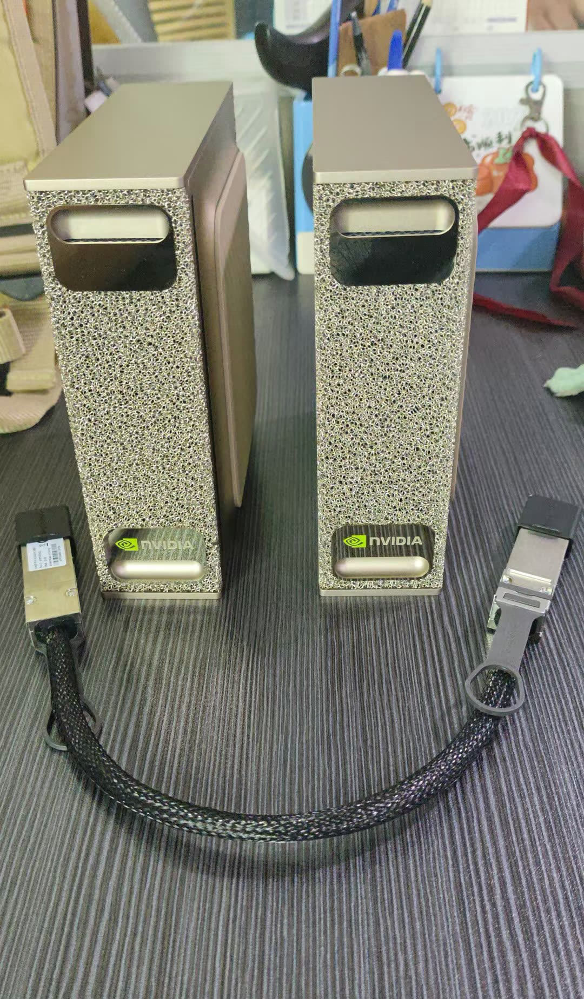
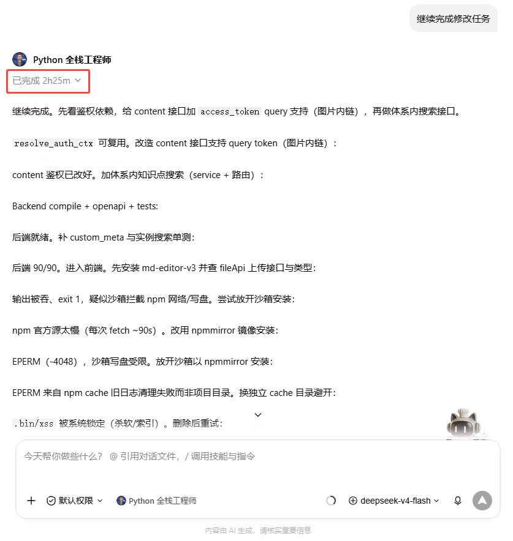
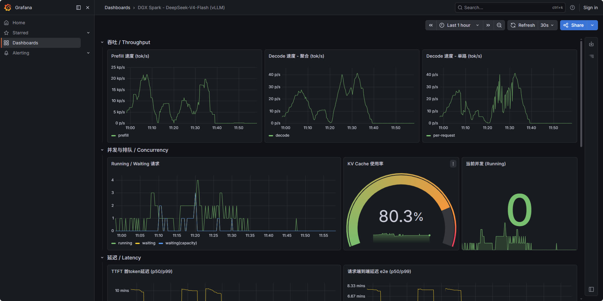

我们花了大约 **6.8 万人民币**，把两台 **DGX Spark** 搬回了办公室。到手才一个月，用途已经从「桌面工作站」变成了「公司内部 AI 机房」。

这篇不讲玄学，只讲三件事：**怎么把它凑成双机、路上摔了哪些跤、以及十个人同时用会怎样。**

最后一节是重点——压力测试的结论可能跟你想的不太一样。

## 硬件：为什么是两台

先说清楚我们手里有什么：

| 节点 | GPU | 内存 | 存储 |
|---|---|---|---|
| Spark 1 | GB10 | 128GB 统一内存 | 3.7TB NVMe |
| Spark 2 | GB10 | 128GB 统一内存 | 3.7TB NVMe |

**GB10 有个和普通显卡完全不同的地方：CPU 和 GPU 共用同一块 128GB 内存。** 这意味着什么？模型权重、KV Cache、CUDA 中间结果全挤在一个池子里。显存大小不再是固定值，而是**你挤出来的**。

两台机器用 ConnectX-7 200GbE RoCE 直连，MTU 9000。为什么要走 RDMA？因为双机跑一个大模型时，两台机器每算一层就要互相对话一次。走普通 TCP，光传输开销就能把计算时间吃掉一半。

我们的分工：Spark 1 当老大（head），Spark 2 当小弟（worker），模型切一半放一台，`tensor-parallel-size 2`。

## 第一个大坑：官方镜像慢 3.65 倍

这是整件事最反直觉的部分。

按官方文档来，你该拉 NVCR 的 Docker 镜像，一行命令跑起来。我们当时也是这么干的，结果速度 **13 tok/s**——社区基准是 49 tok/s。差了 3.65 倍。

**原因是个架构守卫 bug。**

GB10 的架构代号是 `sm_121a`。vLLM 的 CMake 在判断「要不要为这个芯片编译高性能内核」时，用的是 `12.0f` 去匹配。`12.1` 匹配不上，于是官方镜像里根本没有为 GB10 编译的原生 kernel，全程走一条慢得多的回退路径。

**解法很朴素：别用 Docker，用 pip 装。**

pip 安装时工具链会自动检测出真实架构并现场编译原生 kernel。速度立刻从 13 跳到 49 tok/s。

> **记住这个原则：在边缘 AI 硬件上，别相信官方镜像的性能。先跑一版基准，确认 kernel 是不是真的跑在了你的芯片上。**

顺带一提，这个理由也帮我省了个麻烦——国内网络拉 NVCR 极慢，pip + 镜像源反而更快。

## 部署 DeepSeek-V4-Flash：几个关键参数背后的道理

当前主力模型是 **DeepSeek-V4-Flash-0731**，参数规模看着吓人：

| 属性 | 值 |
|---|---|
| 总参数 / 活跃参数 | 284B / 13B |
| 量化 | FP8（官方权重） |
| 权重体积 | ~156 GB（48 个 shard） |
| 上下文 | 1,000,000 tokens |

156GB 权重除以两台机器，每节点大约 81.5GB。加上 KV Cache 和系统开销，128GB 统一内存刚刚好——**这就是「双机顶四机」的全部含义：不是算力翻倍，而是把内存拼够了。**

单机模式是跑不起来的，物理上装不下。

这里有个特别容易踩的坑，值得单独拎出来：**双机模式不要随便开 FP8 KV Cache。**

FP8 KV Cache 的好处是省一半内存，看起来很香。但在 GB10 上，如果没有校准用的 scale factors，vLLM 会用 `q_scale=1.0` 这种没校准的值。而 GB10 的 FP8 attention 内核路径和数据中心级 Blackwell 不一样，结果是——**短输出正常，超过 500 个 token 就开始重复循环。**

MiniMax M2.7 的官方部署指南也明确避开了 FP8 KV Cache。所以我们的 DeepSeek 这台用的是 **bf16 KV Cache**。这直接决定了后面压力测试的结局。

**推测解码是速度提升的关键。**

DeepSeek-V4-Flash 内置了 DSpark 推测解码模块（权重就藏在模型分片里，不用额外下载）。开启后：

| 配置 | 速度 |
|---|---|
| 不开推测解码 | 26.9 tok/s |
| **DSpark（7 tokens）** | **39-42 tok/s（+47~56%）** |

原理是让小模型先猜 7 个 token，大模型一次性批量验证。接受率 55-72%。关键点：**贪心采样模式下输出完全无损**——每个 token 都经过目标模型校验，猜错了就丢弃重来。这是个免费的加速，不牺牲任何质量。

## 踩坑记录：五个真实事故

### 1. 残留进程偷吃内存

失败一次后，内存里躺着一个叫 `VLLM::Worker_TP1` 的进程。**注意大写 VLLM**——用 `grep vllm` 根本搜不到它。

症状是启动时报「显存不足」，明明什么也没跑。两台机器都得清一遍。

> **教训：分布式训练的进程名往往和你 grep 的关键字大小写不一致。清进程前先 `ps aux | grep -i` 看一遍真实名字。**

### 2. venv 里的 nvcc 版本混乱（最坑）

报错：`ptxas: Unsupported .version 9.3; current version is '9.0'`

虚拟环境里的 CUDA 工具链版本对不齐——nvcc 是 13.3（生成 PTX 9.3），ptxas 却是 13.0（只认 9.0）。**这是环境里最阴险的一类问题：每个组件单独看都正常，凑在一起就编译失败。**

解决：强制指向系统 CUDA，绕开 venv 里那套。

### 3. mp 模式 follower 崩溃

分布式后端选 `mp` 时，worker 节点会报 `collective_rpc should not be called on follower node`。加一个 `--headless` 参数解决。

### 4. 端口被占

`29501` 被上一次残留进程占住，启动直接 `EADDRINUSE`。启动前清一下端口就行。

### 5. 两套环境不能共存

机器上同时挂着两套 vLLM 环境（一套跑 DeepSeek，一套跑 MiniMax）。**它们共享同一块 GPU 内存，绝对不能同时启动，否则必然 OOM。** 切换前必须把上一套的进程全部杀干净——包括那些大写名字的残留进程。

## 压力测试：十个人用，机器就顶不住

现在到最实在的部分了。

上面那些 tok/s 数字都是**单人**测的。我们把它开放给全公司用了，情况就变了。

公司把 DeepSeek-V4-Flash 开放给员工做办公和开发——处理合同、写代码、跑内部数据分析。这类工作涉及公司敏感数据，所以本地化部署是刚需，这也正是我们当初买这两台 Spark 的初衷。

**单人体验很好：35-42 tok/s，1M 上下文，响应流畅。**

**然后到了上班高峰期。大约 10 个人同时在线时，问题开始暴露：**

- 卡顿，明显能感知到
- KV Cache 占满后，**首次吐字的延迟严重滞后**——要干等好几秒才出第一个字
- 更糟的是 **Workbuddy 出现「无模型响应」**：一个任务长期停在等待状态，既不报错也不返回，用户只看到一个永远转着的进度条

排查下来原因很明确，而且比预想的更值得警惕：

### 根本瓶颈不是算力，是 KV Cache 容量

我们为了质量放弃了 FP8 KV Cache，用 bf16。代价是每份上下文缓存占的空间翻倍。配置 `max-num-seqs=4`、1M 上下文时，KV Cache 总共只有约 **20GB**。

10 个人并发，每人一份多轮对话历史，缓存瞬间打满。之后新请求没有缓存可用，只能等待释放——这就是「卡顿」和「首次吐字严重滞后」的来源。

而「任务卡死」是另一个层面的问题：**智能体类应用会主动占住缓存。** 一个多步骤任务从开始到结束，整段上下文都挂在缓存里。它不主动退出，别人就得干等。

### 一个容易被忽略的洞察

这里有个反直觉的发现：**智能体应用的缓存命中率其实非常高。** 反复相同的系统提示、工具定义、历史消息前缀，prefix caching 能大幅减少重复计算。

所以算力和算力利用率不是问题，**问题纯粹是缓存池太小。**

一个只能同时容纳 4 份上下文的池子，面对 10 个并发的智能体任务，就像一条四车道的高速上开了十辆车——不是车不够快，是路不够宽。

### 结论

**这台机器跑 DeepSeek-V4-Flash，只适合 1-3 个用户轻度使用。**

超过 3 人并发，性能急剧下降；到 10 人时，已经不是「慢」的问题，而是会出现任务挂起、无响应的功能性故障。

把这笔账摊开看更清楚：**6.8 万人民币的双机组合，在智能体这类缓存敏感的场景里，实际可用容量约等于 3 个人。** 平均下来，一个并发席位接近两万人民币。这个数字本身没错，只是它衡量的是「单机体验速度」，而不是「能供给多少人」。

如果你也在评估这类双机方案的容量，请记住这个教训：**先算 KV Cache 池能装几份上下文，再决定开放给多少人用。tok/s 只能说明一个人用得爽不爽，说明不了整台机器能撑几个人。**

## 下一步：换个小得多的模型试试

现在这个局面其实点明了优化方向——**不是加机器，而是换模型。**

我们计划部署 [Qwen3.8-Flash-Next](https://unsloth.ai/docs/models/qwen3.8-next) 做对比测试。同样是「Flash 级」定位的模型，如果能在相近质量下把权重和缓存占用压下来，那么同样的硬件能服务的用户数可能会翻好几倍。

对比维度会包括：

- 同等并发下的吞吐和延迟
- KV Cache 占用与最大并发数
- 智能体任务的缓存命中效率
- 实际办公场景的任务完成率

结果出来后我单独写一篇。如果你也在自己折腾双机方案，或者已经在跑同类模型，评论区聊，我特别想听听实际并发跑到多少才开始崩。

---

**硬件配置速查**

- 2 × DGX Spark（GB10，128GB 统一内存 / 3.7TB NVMe），购入成本约 **6.8 万人民币**
- ConnectX-7 200GbE RoCE 直连，MTU 9000
- vLLM 0.26.0（jasl fork）+ DeepSeek-V4-Flash-0731
- bf16 KV Cache（约 20GB）+ DSpark 推测解码
- 单人 39-42 tok/s ｜ 推荐并发 1-3 人
