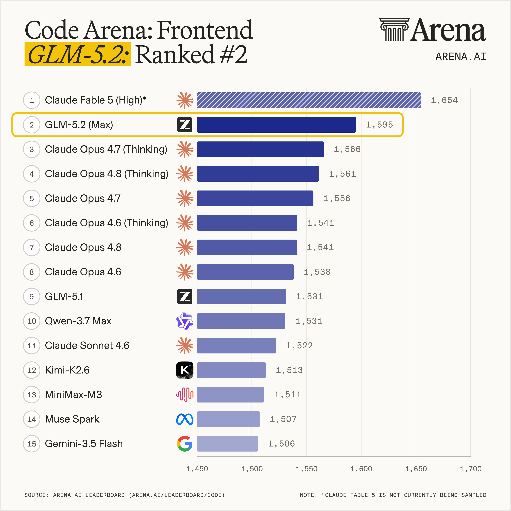
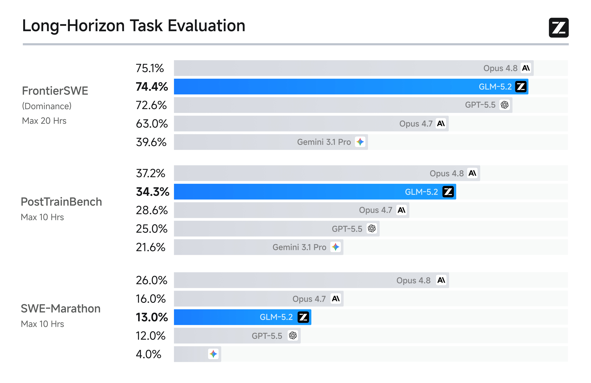
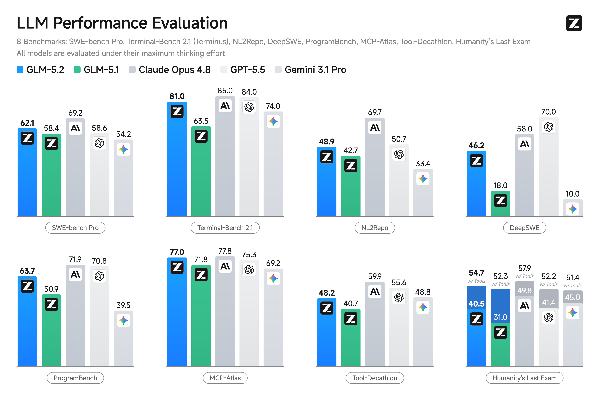

**2026年6月17日** — 智谱今日正式上线并开源新一代旗舰大模型 GLM-5.2，这是目前全球排名最高的开源模型之一，在多项权威评测中与 Anthropic 的 Claude Opus 4.8 仅相差 1%–4%。

## 核心亮点

### 1M 上下文：长程任务真正可用

GLM-5.2 支持真正可用的 **1M 上下文窗口**（最大输出 128K tokens），能够承载项目级工程上下文。在实际测试中，模型累计处理超过 85 万 tokens，接近用满 1M 上下文窗口。智谱用一个直观的例子说明："用一句话描述需求，它就能自主完成开发、联调、测试到打包上线，几小时内交付一个网页、手机、小程序都能用的完整应用，而这过去往往需要一支团队干上数周。"

### Coding 能力：榜单与开发者双重验证

在全球百万用户参与盲测的前端开发评估系统 Code Arena 上，**GLM-5.2 取得全球可用模型第一的表现**。

*Code Arena 全球模型排名（来源：智谱官方）*

在 FrontierSWE、Terminal-Bench 等长程任务基准上：

*FrontierSWE 等长程任务基准测试（来源：智谱官方）*

| 基准测试 | GLM-5.2 vs Opus 4.8 | GLM-5.2 vs GPT-5.5 | GLM-5.2 vs Opus 4.7 |
|----------|---------------------|--------------------|--------------------|
| FrontierSWE | 仅落后 ~1% | 领先 ~1% | 领先 ~11% |
| SWE-Marathon | 差距 ~13% | — | — |

*Coding 能力多维度对比（来源：智谱官方）*

开发者实测反馈显示，GLM-5.2 在以下方面有显著提升：

- **项目级上下文承载更强**，能把完整工程放进同一条推理链路里
- **长程任务执行更稳定**，不容易中途跑偏
- **生产级工程规范遵循更可靠**，能守住团队研发流程里的硬约束
- **客户端与移动端工程能力更扎实**，能完成真机调试闭环

### 开源+国产算力：Day 0 适配

GLM-5.2 以最宽松的 **MIT 协议**开放，可免费商用，无地域限制。线上推理已在第一时间适配多个国产算力平台：华为昇腾、平头哥、摩尔线程、寒武纪、昆仑芯、沐曦、海光、壁仞。

在海外最强模型转向封闭、开源替代需求上升的背景下，这一"开源国模+国产算力"的组合受到产业关注。

## 实际应用场景

1. **项目级工程接管**：让模型一次读懂一整个工程，持续保留模块边界、架构约束、接口契约
2. **长程重构执行**：模块解耦、接口迁移、目录治理等需要连续推进的任务
3. **生产级规范压力测试**：严格遵守代码风格、架构边界、依赖约束、构建流程
4. **移动端真机调试闭环**：从代码实现到设备验证，结合 ADB、logcat 定位真机问题
5. **科研复刻**：从论文数据到可运行工程，自主跑通并对齐论文指标

## 中西结合，效率倍增

GLM-5.2 的发布标志着国产大模型已经进入世界第一梯队。更重要的是，它为开发者提供了一个新的组合思路：**国产模型不但开源，性能也不弱，配合 Claude 和 Codex 等先进工具，中西结合，对提升开发效率有很大帮助。**

在实际开发工作中，可以这样组合：

- **用 Claude/Codex 做架构设计和复杂逻辑推理**：这些模型在深度思考和创意生成方面仍有独到优势
- **用 GLM-5.2 做工程实现和长程任务**：1M 上下文和强大的 Coding 能力，适合处理项目级工程接管、代码重构、规范遵循等任务
- **用国产算力部署**：MIT 协议 + 国产算力适配，既降低成本，又符合数据安全要求

这种组合方式不是简单的替代，而是优势互补。在全球 AI 竞争加剧的今天，开源模型的崛起为开发者提供了更多选择，也让技术进步的红利能够更广泛地惠及产业。

**GLM-5.2 的开源，不仅是一个模型的发布，更是国产 AI 生态走向成熟的重要标志。**
