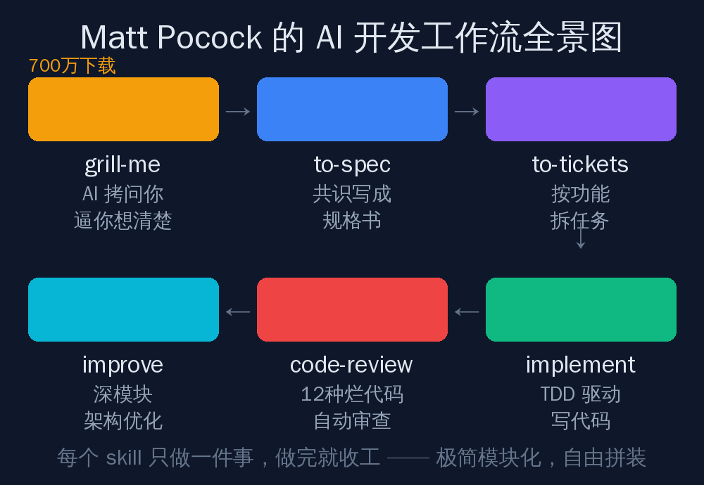
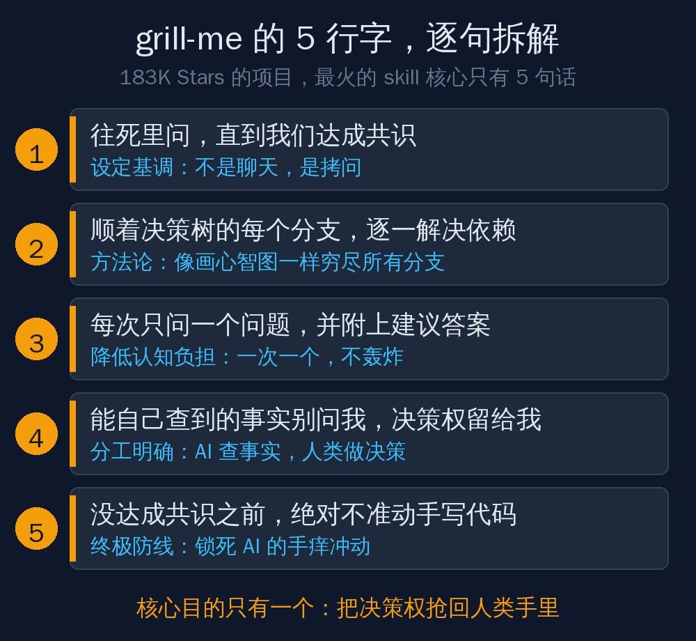
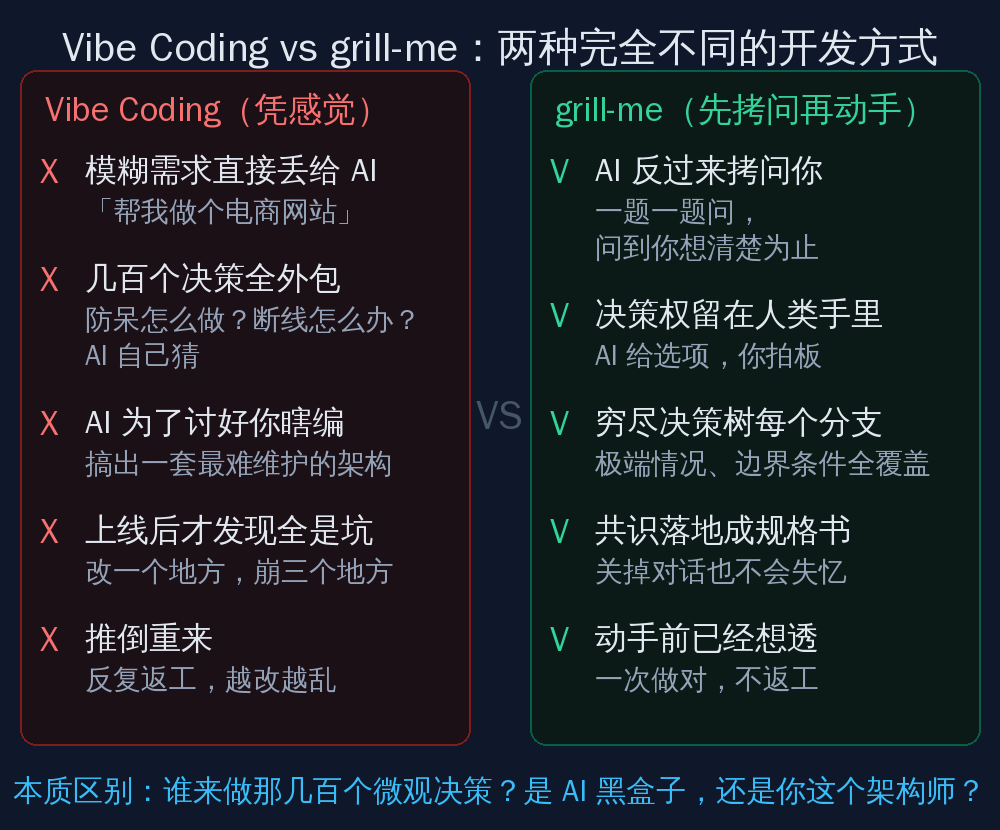
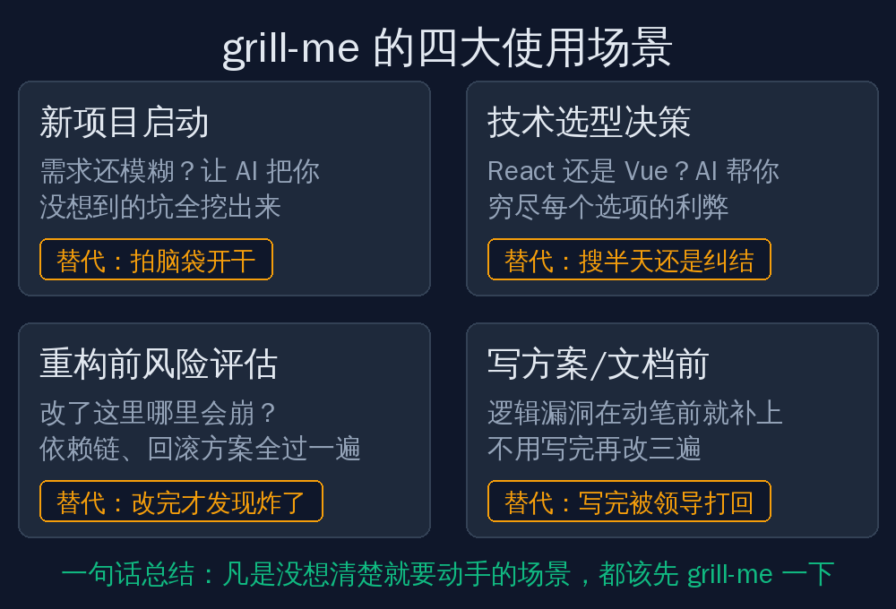

## 先说个前情提要

之前我写过一篇文章叫[《AI大神教你玩Agent：如何全面发掘模型潜力》](../claude-fable-5-agent-guide/)，核心观点就一句话：**模型越强，方法越重要。**

你给 Agent 发了一大段需求，它做出来的东西还是偏离你的预期？这不是模型不行，而是你还不会"问"。

那篇文章讲的是"怎么问"的大方向。今天这篇，我要给你看一个具体的、可以直接抄作业的答案。

这个答案来自 GitHub 上一个 183K Stars 的项目，最火的技能下载量超过 700 万次。而它的核心内容，只有 5 行字。

## Matt Pocock 是谁？

如果你写 TypeScript，大概率听过这个名字。

Matt Pocock 是 TypeScript 领域最知名的教育者之一，他创办的 Total TypeScript 课程帮助了全球数十万开发者。但让他真正出圈的，不是课程，而是他在 GitHub 上开源的一个 skills 仓库。

这个仓库叫 mattpocock/skills，Star 数 183K，Fork 数 15.6K。里面装的不是代码库，而是一整套"怎么跟 AI 协作"的方法论，打包成了一个个可以即插即用的 Skill 文件。

你可以把它理解成：**一个顶级程序员把自己跟 AI 打交道的全部经验，写成了说明书，免费送给你。**

整套工作流长这样：先用 grill-me 把需求问清楚，再用 to-spec 写成规格书，然后 to-tickets 拆成任务，接着 implement 用 TDD 方式写代码，写完 code-review 自动审查，最后 improve 优化架构。

每个 Skill 只做一件事，做完就收工。你可以全用，也可以只挑一个。

而这套流程里下载量最高的，就是第一步——grill-me。

## grill-me 到底干了什么？

一句话：**它让 AI 反过来拷问你。**

注意，不是你问 AI，是 AI 问你。

你平时用 AI 写代码，是不是这样操作的：打开对话框，打一句"帮我做个电商网站"，然后等它输出一大坨代码？

这就是所谓的 Vibe Coding——凭感觉编程。听起来很爽，实际上是在埋雷。

因为"做个电商网站"这句话背后，藏着几百个你没说清楚的决策：用户断线了怎么办？库存扣减用乐观锁还是悲观锁？支付失败要不要自动重试？订单超时多久自动取消？

你没说，AI 就自己猜。而 AI 猜出来的答案，往往是最"正确"但最难维护的那一个。

grill-me 的做法完全反过来：**你还没开口写代码，它先把你按在椅子上，一题一题地问，问到你把所有坑都想清楚为止。**

## 5 行字，逐句拆解

grill-me 这个 Skill 的核心指令，翻译成中文就是下面 5 句话。我一句一句给你拆：

**第一句：往死里问，直到我们达成共识。**

这句话定的是基调。AI 不是来跟你聊天的，是来拷问你的。它不会因为你说了个大概就放过你，它会追着你问细节，问到你把每个角落都翻一遍。

**第二句：顺着决策树的每个分支，逐一解决依赖。**

这是方法论。你脑子里的需求不是一条直线，是一棵树。主干是"做电商"，但每个节点都会分叉：支付方式分叉出微信、支付宝、信用卡；库存管理分叉出预扣、实扣、超卖处理。AI 会像画思维导图一样，把每个分支都走一遍，一个都不漏。

**第三句：每次只问一个问题，并附上建议答案。**

这句话是降低你的认知负担。如果 AI 一次甩出 10 个问题，你大概率会懵。所以它一次只问一个，而且会先给你一个推荐答案。你只需要说"对"或者"不对，应该是这样"。

这就像做选择题，比做填空题轻松一百倍。

**第四句：能自己查到的事实别问我，决策权留给我。**

这句话划清了分工。React 18 和 19 有什么区别？PostgreSQL 和 MySQL 的性能对比？这些事实性问题，AI 自己去查，别来烦你。但"我们这个项目到底用哪个数据库"，这种决策，必须你拍板。

AI 是参谋，你是司令。参谋负责收集情报，司令负责下命令。

**第五句：没达成共识之前，绝对不准动手写代码。**

这是终极防线。AI 天生手痒，你刚说了个大概，它就想开始写代码了。这句话就是给它戴了个紧箍咒：想清楚之前，一个字都不许写。

5 句话，没有一句是废话。每一句都在解决一个真实的问题：基调、方法、节奏、分工、底线。

## 两种开发方式，天差地别

把 Vibe Coding 和 grill-me 放在一起对比，区别一目了然：

左边是你现在的操作方式：需求模糊就开干，几百个决策全丢给 AI 黑盒子，AI 为了讨好你瞎编一套架构，上线之后改一个地方崩三个地方，最后推倒重来。

右边是 grill-me 的操作方式：AI 先把你拷问一遍，决策权留在你手里，每个分支都走到，共识落成规格书，动手之前已经想透了。

**本质区别就一个：那几百个微观决策，到底是谁在做？**

是 AI 在黑盒子里替你猜，还是你这个架构师一个一个拍板？

答案不同，结果天差地别。

## 什么时候该用 grill-me？

不是所有场景都需要被拷问。写个 Hello World 就不用。但下面这四种情况，我强烈建议你先 grill 一下再动手：

**新项目启动。** 需求还停留在"我大概想做个什么东西"的阶段？这时候最危险，因为你觉得自己想清楚了，其实全是模糊地带。让 AI 把你没想到的坑全挖出来，比上线之后踩坑便宜一万倍。

**技术选型决策。** React 还是 Vue？微服务还是单体？用 PostgreSQL 还是 MongoDB？这种问题你在网上搜半天，看十篇对比文章还是纠结。不如让 AI 根据你的具体场景，把每个选项的利弊穷尽一遍，你来做最终决定。

**重构前的风险评估。** 想动老代码？先别急着改。让 AI 拷问你：改了这里，哪里会崩？上下游依赖链是什么？回滚方案有没有？兼容性怎么处理？问完这一轮，你心里就有数了。

**写方案、写文档之前。** 技术方案、产品文档，写之前先被 AI 拷问一轮。逻辑漏洞在动笔之前就补上，不用写完被领导打回来改三遍。

一句话总结：**凡是"没想清楚就要动手"的场景，都该先 grill-me 一下。**

## 为什么 5 行字值 700 万下载？

你可能会想：就这？5 句话而已，我自己也能写啊。

能写，但你大概率不会写。

因为大多数人用 AI 的习惯是"我说你做"，从来没想过让 AI 反过来质疑自己。而 grill-me 这 5 行字，本质上是在纠正一个根深蒂固的误区：**AI 不是你的打字员，是你的陪练。**

打字员你说什么它做什么，做错了是你的锅。陪练会挑战你、逼你思考、帮你发现自己看不到的盲区。

Matt Pocock 在 writing-great-skills 这个 Skill 里总结了三条原则：修剪、指引词、完成标准。翻译成大白话就是：

**删废话**——模型本来就会做的事不用再说一遍，多一句废话就多一分跑偏。

**用行话**——说"Data Clumps"，AI 秒懂要检查什么、怎么修。一个专业术语顶一百句解释。

**定终点**——没有完成标准，AI 会无限发散，或者提前交差。"达成共识之前不准写代码"就是最硬的终点。

grill-me 就是这三条原则的完美示范：5 行字，没有一句废话，用了"决策树""依赖"这些精准术语，最后用"不准写代码"锁死了终点。

## 最后说两句

上次那篇文章我讲了一个比喻：地图和疆域。你写给 AI 的提示词是地图，真实需求是疆域。地图画得越准，AI 走的路就越对。

grill-me 做的事情，就是**在画地图之前，先逼你把疆域走一遍。**

你不需要会写 TypeScript，不需要懂什么 Skill 文件格式。你只需要记住一个思路：**下次让 AI 干活之前，先让它把你问倒。**

被问倒不丢人，带着模糊的需求让 AI 瞎猜，上线之后翻车才丢人。

---

*为了方便大家学习，我把 Matt Pocock 的 skills 仓库地址放在这里：github.com/mattpocock/skills 。关注公众号【虾大师】，回复关键字"grill"，获取本文提到的全部 Skill 文件打包下载。*
