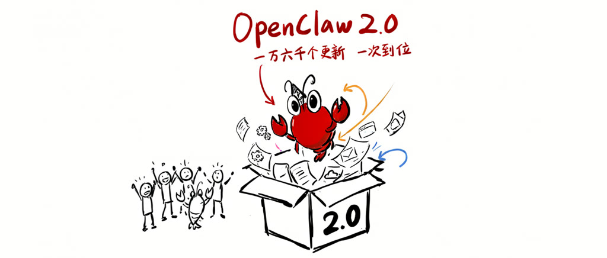
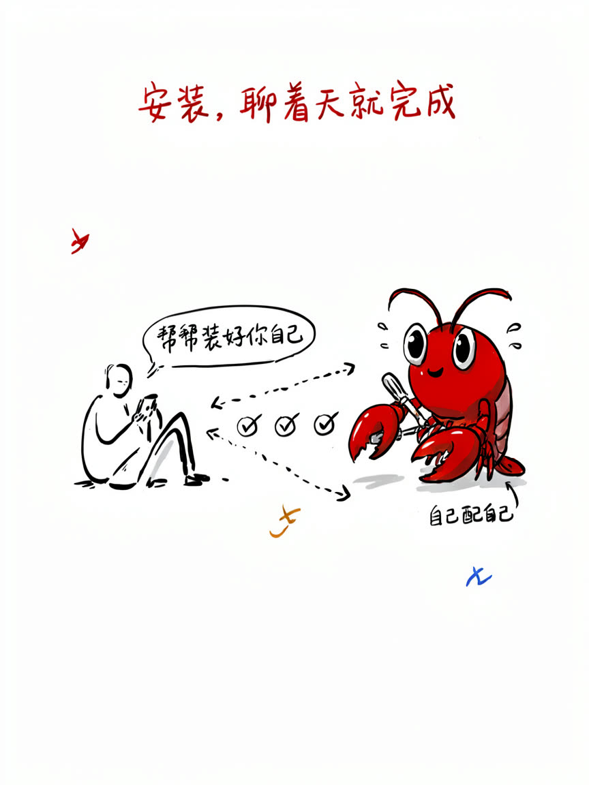
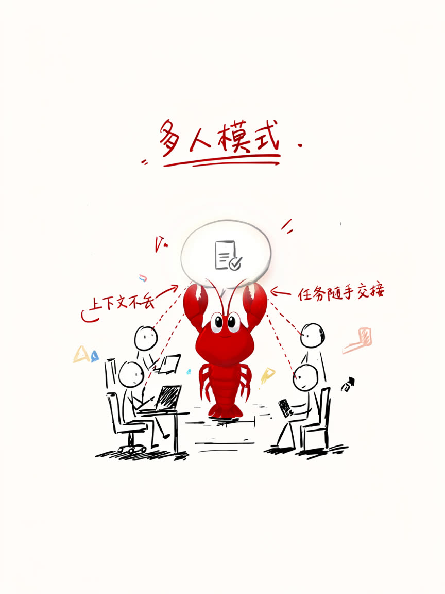
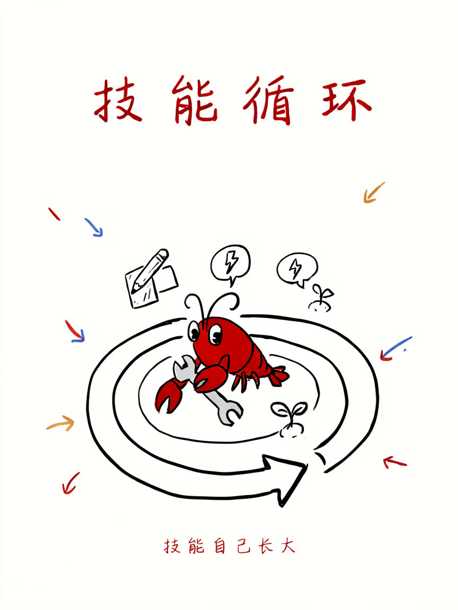

8 月 31 日，开源 AI 助理 OpenClaw 发布了它历史上最大的一次更新——**2.0**（版本号 v2026.8.1）。

先报几个数字，你就知道这次有多夸张：

- **933 位贡献者**参与，其中 569 人是第一次给这个项目写代码
- 一口气合并了 **16000 多个代码更新（PR）**，差不多是 OpenClaw 有史以来合并过的全部 PR 的一半
- 发布当天就冲上了 Hacker News 热榜，评论区吵了 170 多楼

一句话总结：**这只「小龙虾」从一个能帮你干活的个人助理，进化成了一个能和家人、同事一起用的「多人助理」。**

## 为什么叫「一不小心搞出来的 2.0」

这次更新有个很有意思的官方说法：**Accidentally（一不小心）**。

团队最初只想做两件小事：把安装变简单、把网页版重做一遍。结果改着改着发现，这两件事要做好，就得把安装、消息、记忆、技能、模型、定时任务、浏览器、插件、安全……全都翻新一遍。等回过神，已经是一次彻底的大版本更新了。

要知道，在这次之前，OpenClaw 230 天里发了 106 个版本，几乎一两天一个。而这次他们**整整憋了七周没发版**——就是在憋这个大的。

## 重大突破一：安装简单到「聊着天就装完了」

以前装 OpenClaw，对小白不算友好。2.0 的思路完全变了：

- 直接**复用你电脑上已有的东西**：ChatGPT / Claude 的订阅、API key、本地模型，有什么用什么
- 配置项大幅砍掉，剩下的挪出初始流程，先让你和它说上第一句话
- 剩下的设置？**直接跟它聊着完成**——它自己帮你配自己

## 重大突破二：网页版重做，对话就是一切

大多数人第一次用 OpenClaw 就是在网页上。2.0 把网页版整个重建了：

打开就是一个对话窗口，文件、审批、设置、正在跑的任务全都围在对话旁边。你不用再在好几个工具之间来回跳——**看着它干活、顺手改设置、随时接手，一个页面搞定。**

## 重大突破三：「多人模式」来了

这是我认为**本次最有突破性的变化**。

以前，一只 OpenClaw 只服务于一个人。任务想交给别人？上下文就断了。2.0 引入了**共享云端会话（Shared cloud sessions）**：

- 你可以把正在进行的任务**拉另一个人进来**，他能看到这只虾已经知道的一切
- 也可以把任务**整个移交**出去，上下文原封不动
- 官方团队现在就是用这种方式、多人协作开发 OpenClaw 自己的

AI 助理从「我的私人工具」，变成了**可以交接、可以协作的团队基础设施**。

## 重大突破四：技能闭环，会自己进化

OpenClaw 的「技能（Skills）」就是把你的工作方法变成可复用的指令。2.0 把整条链路打通了：

**创建 → 校验 → 安装 → 在对话里直接调用 → 审查改动 → 下一轮对话就生效。**

更进一步的是「技能工坊（Skill Workshop）」：它会把你的大量工作和纠正**自动整理成改进建议**，你审查确认后，技能就升级了。也就是说，**技能会跟着你的使用习惯自己长大**。

## 其他值得一提的升级

篇幅有限，挑重点说：

**记忆升级**：内置记忆引擎接管了搜索和回忆，能跨私有对话召回相关上下文（包括重置前的重要信息），而且**看得见、可搜索、可删除**——不再是黑盒。

**会用浏览器和电脑了**：可以让它用**已登录的浏览器会话**干活（隔离的受管配置，或者你指定共享的 Chrome 标签页），还支持操控配对的 Mac 和 Windows 电脑。

**消息渠道更多更稳**：Telegram 消息更丰富、Discord 支持语音房间、飞书/Teams/Matrix 等几十个渠道全覆盖，重启后消息也不会丢。

**安全更扎实**：每个审批都绑定到具体的请求、会话和人；设备解绑即收回旧权限；敏感凭据不再经过模型可见的文本。

## 写在最后

从 2025 年底的一个周末项目，到现在 GitHub 上 38 万+ star、增长最快的开源项目之一，7 月刚成立了非营利的 OpenClaw 基金会，8 月底就端出了这个 2.0。

这次更新真正有意思的地方，不是某一个功能，而是**方向的转变**：OpenClaw 不再满足于做「一个人的助理」，而是开始做**人和人之间可以传递、可以协作的助理**。软件不再是你只能接受的成品，而是你可以指挥它、塑造它、真正拥有它的东西。

如果你还没试过，现在安装门槛已经是历史最低——聊着天就能装完。值得花半小时体验一下，这只虾到底能帮你干多少活。
