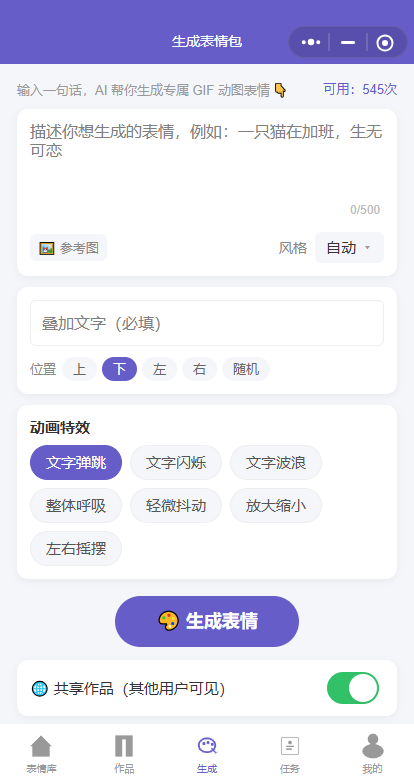
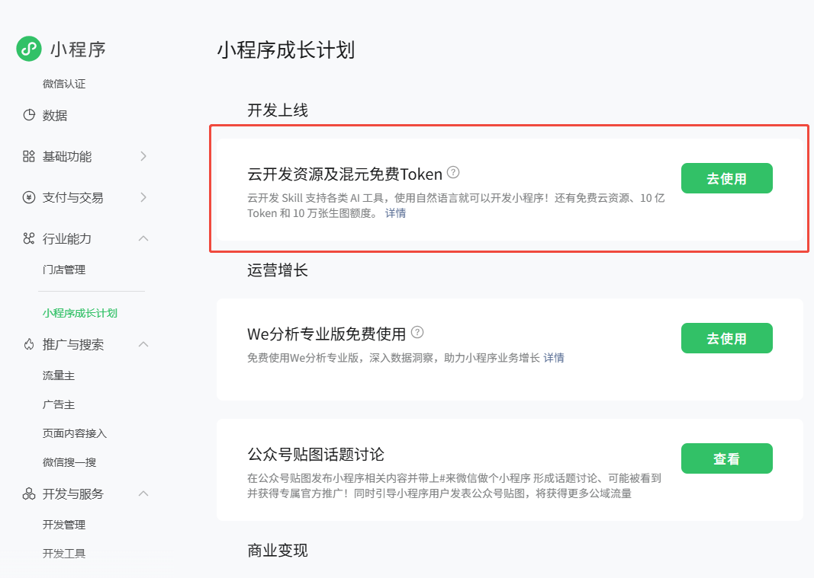
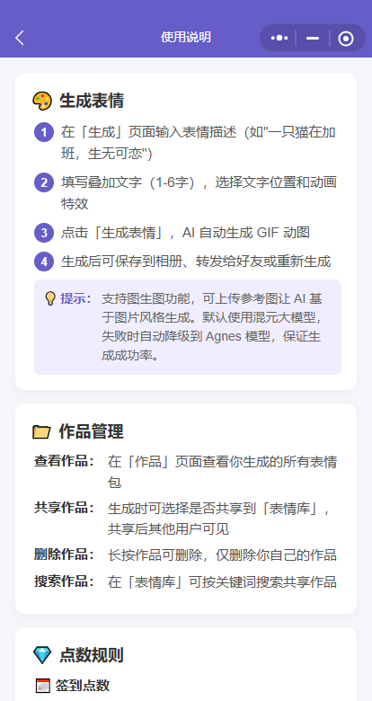
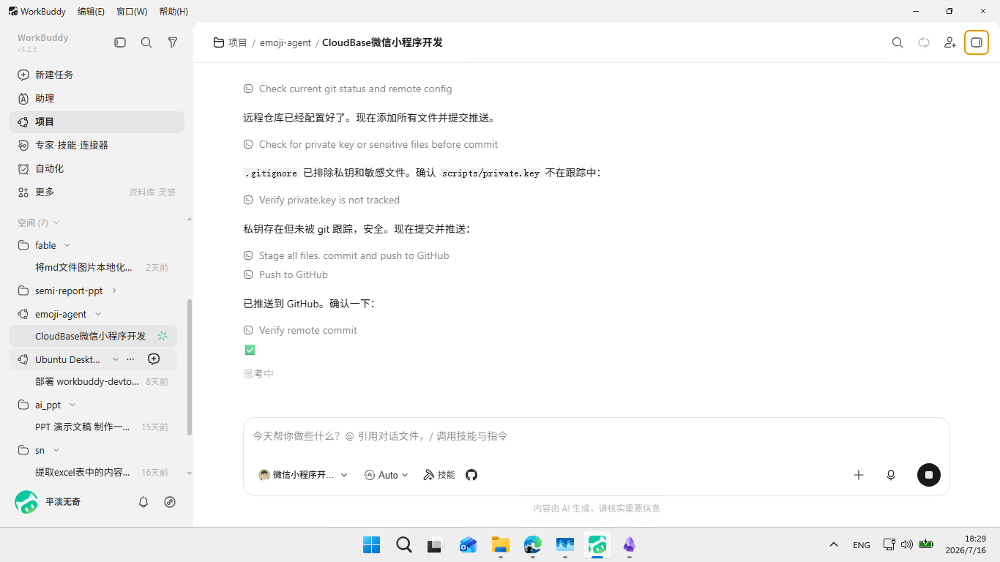

## 一、一个没有开发经验的人，一天能做出什么？

我有一个想法很久了：做一个 AI 表情包生成器。输入一句话，AI 自动生成 GIF 动图表情，分享给朋友聊天用。

但我面临一个现实问题——**我完全没写过微信小程序，也不懂后端开发**。

如果放在以前，这个想法大概率会烂在脑子里。要么花几万块找外包，要么花几个月从头学前端和后端。但这一次不一样——我有了 WorkBuddy。

**一天之后，我手上是一个功能完整、可以直接打开体验的 AI 表情包小程序。**

从 AI 生图引擎到点数系统，从作品管理到个人中心，从签到任务到定时清理——全部由 WorkBuddy 驱动开发。而整个过程的成本是：**零元**。

---

## 二、零成本技术栈：免费资源撑起一个完整产品

做一个小程序需要什么？AI 模型、服务器、数据库、存储、部署工具。这些加起来要多少钱？

答案是一分钱不花。

| 环节 | 用什么 | 成本 |
|------|--------|:---:|
| AI 生图模型 | 腾讯混元 HY-Image 3.0 Plus（CloudBase AI+） | 0 |
| 降级备胎 | Agnes Image 2.1 Flash | 0 |
| 后端服务 | CloudBase 云函数（Node.js） | 0（个人版） |
| 数据库 | CloudBase 云数据库 | 0 |
| 图片存储 | CloudBase 云存储 | 0 |
| 定时任务 | CloudBase 定时触发器 | 0 |
| 前端框架 | 微信小程序原生 | 0 |
| 部署上传 | miniprogram-ci 命令行工具 | 0 |

这里特别要说一下 **CloudBase 小程序成长计划**。腾讯为小程序开发者提供了丰厚的免费额度——**10 亿 token** 和海量生图额度。对于个人开发者来说，这意味着你可以在不花一分钱的情况下，接入顶级大模型能力，支撑一个产品从验证到冷启动的完整周期。

CloudBase 作为服务端底座，承担了所有后端工作：云函数处理业务逻辑，云数据库存储用户数据和作品记录，云存储托管用户上传的头像和生成的 GIF 图片。你不需要买服务器、不需要配 Nginx、不需要管运维——写完代码，一行命令部署，全部在云端跑起来。

**从 AI 模型到服务器到数据库到部署，真正的零成本全栈。**

---

## 三、产品功能：麻雀虽小，五脏俱全

虽然只是一天做出来的产品，但该有的功能一个不少：

### 🎨 AI 生成表情包

输入描述（比如"一只猫在加班，生无可恋"），加上叠加文字，选择动画特效——点击生成，AI 自动调用混元大模型生成底图，前端 Canvas 合成带文字动画的 GIF 动图。支持文生图和图生图两种模式。如果主模型出问题，Agnes 模型自动顶上，用户完全无感知。

### 📁 作品管理

生成的表情包自动保存到云端。可以在「作品」页面查看、删除，也可以选择共享到「表情库」让其他用户看到。长按作品即可删除，只能删除自己的，数据安全有保障。

### 💎 点数系统

这是整个产品最复杂的模块。三类点数各有权重和有效期：

- **签到点数**：每天点击签到获得 10 次生成额度，当日有效，不签到就没有
- **赠送点数**：通过兑换码获取，永久有效不过期。兑换码可通过活动或社群获取
- **任务点数**：通过分享、收藏等任务获得，30 天有效。每天最多完成 10 次任务

消耗时按优先级自动扣：签到点数（当日有效）→ 赠送点数（不过期）→ 任务点数（30 天）。每天 0 点，定时任务自动扫描并清理过期点数，写入明细记录。

### 👤 个人中心

支持设置微信头像和昵称，查看点数明细（签到/赠送/任务/使用/过期，每条记录都有时间和分类标签），兑换码入口，以及完整的使用说明。

### 📖 使用说明

从如何生成表情，到作品管理方法，到三类点数的获取和消耗规则，再到常见问题——一个独立页面讲清楚所有事情。

---

## 四、WorkBuddy 开发体验：描述需求，它写代码

WorkBuddy 和传统 AI 编程助手最大的区别是什么？**它不是帮你补全代码，而是帮你从零构建产品。**

### 需求即代码

我不需要知道 `wx.cloud.callFunction` 怎么调用，不需要研究混元 API 的文档格式。我只需要说：

> "做一个生成表情的云函数，输入提示词，调用混元大模型生成图片，返回结果"

WorkBuddy 会自己查 CloudBase 文档、理解 API 参数、写出完整的云函数代码、配置超时和环境变量，然后部署上线。

### 改规则不用翻代码

最让我震撼的是修改点数系统那次。原来的规则是"每天自动送 10 点"，我要改成：

- 取消自动赠送，改为手动签到
- 赠送点数仅通过兑换码
- 任务点数加 30 天过期

涉及云函数核心逻辑、三个前端页面、数据库流水记录格式。传统开发中这种改动至少要半天，还容易漏改。

我只需要说清楚新规则，WorkBuddy 自己分析了所有相关文件，一次性完成了云函数重构、三个页面的字段名替换、点数明细的分类映射更新，然后自动部署。全程不到一小时。

### Bug 修复像聊天

"生成失败了但点数还是被扣了"——我把现象告诉 WorkBuddy，它自己读代码分析链路，发现问题出在"先扣点后生成"的顺序上。然后重构为"先检查配额 → 生成 → 成功后再扣点"，同时加了主模型失败自动降级到 Agnes 的兜底逻辑。

### 部署也是一句话

不需要打开微信开发者工具，不需要手动点上传。WorkBuddy 直接调用 `miniprogram-ci` 命令行工具，一行指令完成打包上传。云函数也是同样的体验——改完代码，说一句"部署"，它就调 CLI 搞定。

---

## 五、从 1.0.0 到 1.0.5：一个产品的迭代实录

一天之内，这个项目经历了 6 个版本的迭代：

| 版本 | 做了什么 | 耗时 |
|------|---------|:---:|
| v1.0.0 | MVP：文生图 → Canvas 合成 GIF 动图，作品保存和分享 | 上午 |
| v1.0.1 | 修复"生成失败还扣点"的 Bug，增加 Agnes 降级方案 | 30 分钟 |
| v1.0.2 | 点数体系重构：签到/赠送/任务三类，定时清理过期 | 1 小时 |
| v1.0.3 | 点数明细页面优化：分类标签 + 图标 + 颜色 | 20 分钟 |
| v1.0.4 | 个人资料保存逻辑修复，冷启动头像丢失修复 | 30 分钟 |
| v1.0.5 | 关于弹窗、版本验证 | 10 分钟 |

6 个版本，每次迭代就是和 WorkBuddy 说几句话。没有排期会议，没有等待前后端联调，没有"这个需求下个迭代再做"。**想到就改，改完就上线。**

---

## 六、遗憾：做出来了，但上不了线

写到这，你可能想问：那这个小程序现在能用吗？

答案是：**可以扫码体验，但无法正式发布上线。**

微信小程序对 AI 生成内容类产品有严格的类目资质要求。个人主体无法通过审核——需要企业营业执照、需要《增值电信业务经营许可证》、需要对应的内容安全类目许可。这不是技术问题，而是平台政策门槛。

所以这个产品目前只能停留在「体验版」——我可以用微信扫码打开，可以生成表情、签到、做任务，功能一切正常。但它永远无法出现在微信搜索里，也无法被陌生人发现。

**但这不影响我写这篇文章想表达的结论。**

一个完全没有小程序开发经验的人，不写一行后端代码，不花一分钱，借助 WorkBuddy + CloudBase + 免费 AI 模型，一天之内做出了一个功能完整、可以直接体验的 AI 产品。

以前，想法和产品之间隔着"我不会写代码"这座大山。现在，这座山被 AI 铲平了。

---

## 七、结语：让不可能变成可能

AI 开发的意义不在于"替代程序员"，而在于**让那些有想法但不懂技术的人，第一次拥有了把想法变成产品的能力**。

我脑子里放了好几年的表情包小程序想法，在遇到 WorkBuddy 之后，一天就变成了可以打开体验的实物。过程中我没写一行 `SELECT * FROM`，没配一次 Nginx，没翻过一次混元 API 文档。我只是不断地描述我想要什么，WorkBuddy 负责把它做出来。

免费资源的组合也让这件事的门槛降到了零。CloudBase 个人版 + 小程序成长计划的 10 亿 token + Agnes 免费模型——对于个人开发者来说，从验证想法到冷启动，完全不需要考虑成本问题。

**下一个用 AI 一天做出来的产品，可能就是你脑子里那个放了好几年的想法。**

试试吧，把那个想法告诉 WorkBuddy。你会惊讶于它能做到的事情。

---

程序已开源，源代码在：[https://github.com/ayeah/emoji-miniapp](https://github.com/ayeah/emoji-miniapp)

体验一下，有时间限制，如果无法用了，就是过期了。
